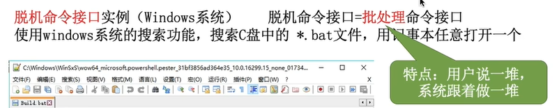
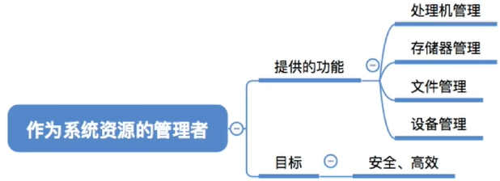
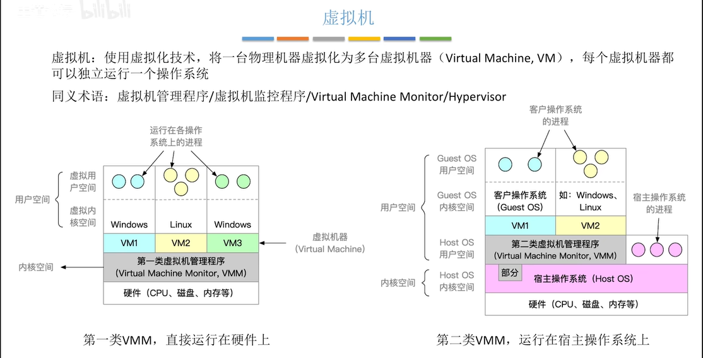

# ch1 操作系统导论

## 计算机结构

## 操作系统基本概念

-   **操作系统**是运行在内核态的软件<u>（其他系统软件、用户应用程序正常情况下运行在用户态，除非进行系统调用）</u>

-   （**功能**）充当计算机用户和计算机硬件之间的媒介：

    1.  为应用程序员（或应用程序）提供更方便编程的**虚拟机（扩充机器，即扩充被操作系统覆盖的硬件裸机）** —— 隐藏硬件，提供硬件资源清晰的、一致的抽象接口；

        

        图形化界面接口：

        

        命令接口：

        

        （即命令行）

        

        （如自己写的键盘禁止、启动.bat程序，以及LINUX里写的.sh程序）

        程序接口：

        普通用户不能直接使用程序接口，实际上是使用的用户程序代码中用某编程语言对应的系统调用库函数；程序员可用汇编语言直接使用系统调用

        

        

    2.  作为硬件的**资源管理者** —— 管理和分配资源，实现不同硬件对同种资源的时间复用和空间复用，是最接近硬件的软件

        

        

    3.  是计算机中**最基本的系统软件**

-   **程序控制**：控制**用户程序**的CPU执行和 I/O 设备的工作

-   设计目标：

    能执行程序员编写的应用，并让程序员的问题更容易解决；

    让计算机系统更容易使用；

    使计算机硬件能被高效使用；

    使系统功能易于扩充

-   **内核**是操作系统的核心，任何时候都在运行，服务于操作系统其他部分；**内核**由许多**内核程序**组成

-   **CPU运行状态：**

    由**程序状态字寄存器（PSW）**记录，1=**内核态（管态）**，0=**用户态（算态）**；

    **特权指令（privileged instruction）**只允许在**内核态**运行，**非特权指令**可以在**内核态**也可以在**用户态**（操作系统可以直接使用非特权指令），**访管指令（陷入指令，即汇编中的TRAP指令，supervisor instruction）**只能在**用户态**执行，用于从用户态请求进入内核态；

    运行**内核程序**时CPU为内核态，运行**应用程序**时CPU为用户态；

    从内核程序进入应用程序时，内核程序最后将**PSW**设为0，**主动让出CPU**；从应用程序进入内核程序时，CPU发现应用程序出现特权命令（如由黑客植入的）或应用程序发出中断（见系统调用）后，将**PSW**设为1，**陷入内核**

-   **广义中断**：

    目的是<u>让**操作系统**夺回CPU使用权</u>（即所谓的“陷入操作系统、陷入内核”），中断发出后CPU交给各种中断信号对应的<u>**中断处理程序**（操作系统内核程序）</u>；

    **中断向量表**：存放不同中断信号的**中断处理程序**的内存地址；

    **内中断（软中断）** —— 由CPU当前程序内指令引发，包括：

    -   **陷阱（Trap）** —— 用户程序有意请求陷入内核，如**系统调用**、程序调试功能
    -   **异常（Exception/ Fault）** —— 用户程序运行出错被CPU检测到（交给异常处理程序处理，处理成功后返回用户程序重新执行出错位置），如缺页中断、黑客插入的特权指令
    -   **终止（Termination/ Abort）** —— 用户程序运行出现致命错误（不可修复），无法处理，无法返回用户程序，终止运行，如硬件错误、分母为0等无法处理的程序错误

    **外中断（硬中断/ 狭义中断）**—— 由CPU外部触发，包括：

    -   **正常工作所需中断**，如时钟中断
    -   **可屏蔽中断**，如I/O设备中断（通知I/O已完成）
    -   **不可屏蔽中断**，如电源掉电、线路故障

## 操作系统的特征

**最基本：并发和共享**

### 并发（Concurrent）

<u>宏观（用户感知）同时、微观（实际）交替</u>，靠**操作系统设计**实现（*单道程序系统不能并发*）

≠ **并行（Parallel）** —— 真正的同时发生，靠**CPU的多核**实现（*单核CPU不能并行*）

**无法无限核，所以并发性是必要的！** 

### 共享

**互斥共享**：用到是同一个资源但不能同时用

**同时共享**：并发（分时）共享或并行共享

-   并发共享例子：

-   并行共享例子：扬声器同时输出视频和音乐的声音

***并发和共享互为条件：不能并发则共享失去意义，不能共享则无法并发*** 

### 虚拟

对空间虚拟化：**空分复用技术**（如虚拟内存技术）

对时间虚拟化：**时分复用技术**（如时间片轮转技术，即虚拟处理器技术）

***并发是虚拟的条件：不能并发则虚拟失去意义*** 

### 异步

让进程轮流使用有限资源，各个进程<u>以不可预知速度轮流走走停停</u>

***并发是异步的条件：不能并发则不会发生异步***

## 操作系统的类型

-   单体结构

    整个操作系统都在内核态，以过程集合的形式编写，链接形成一个大型可执行程序

    优点：每个过程（类似函数）可以自由调用其他过程

    缺点：只要有一个过程崩溃就会连累整个系统	

-   微内核结构 

    将操作系统划分成多个小模块；其中有一个只包含部分重要功能的微内核模块，只有它运行在内核态，其他模块和用户程序一起运行在用户态

    优点：内核态下出错概率降低，对系统的影响减小；任何模块的出错都不会影响整个系统，只是模块本身崩溃
    
-   分时

    时间片轮转

    缺点：绝对公平，无法优先处理紧急任务

-   实时

    设置优先级，优先相应紧急任务（不需要对时间片排队）

    优点：即时可靠

## 系统调用（System Call）

### 概念

和**过程调用（Call）**的区别：

-   **System Call** 是动态调用（根据执行按需求载入库函数），**Call** 是静态调用（要使用的函数都已是用户程序的一部分）

-   **System Call** 进入**内核态**完成实现，**Call** 在用户态实现

-   **System Call** 在内核中实现函数时可以嵌套，在用户进程调用时不允许嵌套；不能递归

-   调用和跳转方式不同：

    （汇编中）int/ trap =》**System Call**，只能跳转到有限个固定地址；call/ jmp =》**Call**，可跳转到任意有效地址

-   与进程调度的关系不同

    采用抢先式调度时，<u>在系统调用返回时</u>，需要进行重新调度的检查，以判断是否有更高优先级的任务就绪（一般过程调用每个时钟中断检查一次优先级）

### 过程

用C程序完成：【加粗部分和一般的过程调用没有很大区别，即用户感知的调用过程】

**用户程序（调用者）把系统调用参数压入堆栈段 -> 以正常过程调用调用用户空间库过程** -> 库过程把该<u>系统调用编号存入寄存器</u> -> 执行<u>访管/ 陷入指令（TRAP）</u>，引发<u>中断（*陷入型\<Trap>*中断）</u> -> <u>CPU陷入内核</u>，开始执行内核固定地址处代码 -> 内核根据寄存器中<u>系统调用编号</u>，对照一张指针表（中断向量表），为该调用<u>分配指针指向的系统调用处理器（即中断处理程序）</u> -> 系统调用处理器运行，执行<u>特权指令</u> -> 执行结束，<u>CPU返回用户空间</u>库过程 -> **库过程返回调用者程序** -> **清除堆栈（即回退SP，清掉之前用到的调用参数）** 

## 操作系统的引导

即计算机开机时**操作系统的启动过程**

***操作系统存储在C盘！***

①（整个CPU）ROM => 硬件自检；②（整个磁盘）MBR => 装载分区；③（每个分区）PBR => 装载自身操作系统；④（每个分区）启动管理器 => 初始化本操作系统

## 虚拟机

（但物理硬件性能可能很强，只允许一个操作系统有所浪费）

