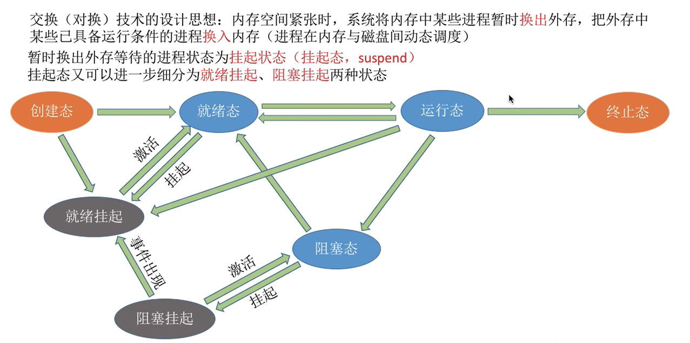

# ch2 进程与线程

## 程序 & 进程的概念

### 程序（Program/ Text）

一个可执行代码<u>文件</u>

**本质：**静态的指令集合

### 进程（Process/ Job）

**程序**的一次运行<u>过程</u>

**本质：**动态的指令（程序）、数据【具体：数据段、堆栈段、代码/正文段（进程的BSS段不映射到内存，只是编译时记录其大小<未初始化>，开始运行时初始化并归位至数据段/堆栈段，和归到的段一起映射到内存）】 & 进程管理信息（在**PCB**中）的集合

**引入目的：**更好地使<u>多道程序（可能是同一份程序的多份复制）并发</u>执行，提高<u>资源利用率</u>和<u>系统吞吐量</u>

### 进程实体/ 进程映像（Process Entity/ Process Image）

**进程**的一份<u>快照（Snapshot）</u>

**本质：** **进程**在某时刻的状态

## 进程上下文

寄存器值、程序计数器、内存分配情况、打开文件列表等等和<u>进程运行产生的实时信息</u>

## 进程表

在<u>内核空间</u>的表，由操作系统维护，每个进程一个表项，即**PCB（进程控制块）**，包含管理进程的重要信息，包括进程调度管理、存储管理、文件管理等**上下文**信息。

-   **调度管理**
    -   PID
    -   父进程PID
    -   数据寄存器的值
    -   PC的值
    -   PSW的值
    -   堆栈指针
    -   进程状态`State`
    -   进程开始时间
    -   已用CPU时间（有效执行时间，Burst Time）
    -   下次定时器时间
    -   ......
-   **存储管理**
    -   正文段指针
    -   数据段指针
    -   堆栈段指针
    -   ......
-   **文件管理**
    -   根目录
    -   工作目录
    -   文件描述符
    -   用户ID
    -   组ID
    -   ......

## 进程的状态

*（指在内存中的状态，不包括挂起态，挂起态是将进程换出内存等待再被换入）* 

由**PCB**中的`State`变量来记录进程状态；同一状态下的**PCB**以某种方式组织在一起统一管理，`State`改变时做出相应调整：

-   **链表** 

    

-   **索引**

    

***状态转移过程必须不能被中断打断！！内核中会用开中断指令 & 关中断指令包起状态转移部分的指令（见原子指令）*** 

### State 1：创建（New/ Created）

#### 时机

-   系统初始化时，创建必要内核进程（如MBR、PBR中的引导程序）
-   已运行进程发出系统调用，创建内核进程（中断处理程序）
-   用户执行命令或启动应用程序，创建进程
-   批处理作业（Batch Job）初始化时，创建进程

****

#### 任务

1.  分配 **PID**（操作系统视角的进程标识符）
2.  在内存分配空白 **PCB**（存进程管理需要的所有信息）
3.  分配进程运行所需的资源：对进程的数据段（包括文件内存映射、I/O内存映射）、堆栈段、BSS段、代码/正文段的大小进行计算，进而安排在内存中的位置；<u>未获得CPU！！！</u> 
4.  （根据分配情况）初始化**PCB**（包括页表的创建）

****

#### 状态转移

-   进程**创建**工作完成<u>且</u>进程<u>就绪队列允许排入新进程</u> =》**就绪**

### State 2：就绪（Ready）

#### 任务

资源分配到位但缺CPU，等待调度（获取CPU）

****

#### 状态转移

-   进程被调度，获得CPU =》**运行**

### State 3：运行（Running）

#### 任务

将**上下文**从**PCB**载入物理寄存器、PC、PSW等等中，CPU从PC指示的指令处开始运行程序

****

#### 状态转移

-   <u>**时间片（Time Slice/ Slot）**用尽</u>或<u>CPU被抢占（但资源仍保有）</u> =》**就绪**
-   运行至<u>系统调用</u>、<u>同步I/O</u>、需要<u>恢复异常</u>（CPU将陷入内核）、<u>请求等待某事件发生</u>或等待暂不可用的资源 =》**阻塞**（进程本身在逻辑上无法继续运行）【主动】
-   运行至<u>不可恢复错误</u>或运行<u>结束</u> =》**终止**
    -   内部错误 =》主动
    -   外部错误（硬件） =》被动
    -   正常结束 =》主动
    -   被另一进程杀死而结束 =》被动

### State 4：阻塞（Waiting/ Blocked）

#### 任务 

<u>CPU被没收</u>，当前**上下文**保存到**PCB**，进入等待

****

#### 状态转移

-   系统调用完成、I/O完成、异常恢复完成、等待的事件发生或申请的资源被分配 =》**就绪**【被动】

### State 5：终止（Terminated）

#### 时机

-   内部错误 =》主动
-   外部错误（硬件） =》被动
-   正常结束 =》主动
-   被另一进程杀死而结束 =》被动

****

#### 任务

释放内存并移除PCB

## 线程（Thread）

### 概念

**进程**的一个执行单元，**线程 = 轻量级进程**，**进程 = 单线程**  

<u>独享</u>线程ID、PC、寄存器集合、PSW和堆栈

<u>共享</u>（同进程内线程）地址空间、全局变量、打开文件、子进程、定时器...... 但<u>不拥有</u>系统资源（无法控制其他线程对共享数据的修改）

### 目的

-   减小多进程并发执行时的（换入换出产生的）时空开销（因为可拆成小的线程调度），提高并发性能
-   可提高 I/O 密集型进程的执行效率（一个线程I/O时执行另一个线程）
-   多核系统的内核级线程能提高并行性

### 用户级线程和内核级线程 

**用户级线程**由进程自行管理（编写运行时系统），对内核（操作系统）透明

**内核级线程**由内核统一管理（几乎当作进程管理）

### 编程

-   `pthread_t`（线程数据类型）

-   `pthread_create`

-   `pthread_exit`

-   `pthread_join`（等待特定线程退出）

-   `pthread_yield`（释放CPU以运行另一个线程）

    *代码示例见课本p61*

## 进程间通信

这部分建议直接把课本读烂，读到可以用自己的话自己的理解给另一个人讲明白的程度，因为考试做题大概就是这种感觉

### 原子指令/ 原语（primitive）

执行期间<u>不允许被中断打断</u>的（一组）内核指令（或对应系统调用）

**实现**：用<u>开中断指令</u>和<u>关中断指令</u>把需要原子化的一段指令包起来

****

### 竞争条件（Race Condition）、临界区与互斥（Mutual Exclusion）

含义见课本p67-p68

****

### 好的互斥应满足的条件 × 4

见课本p68

****

### 忙等待策略

*（代码看课本p69-p71）*

<u>*互斥成功（避免竞争条件）前提：共享变量（Lock variables，用于实现进程间通信）必须有特定机制实现对其访问的互斥（Disable Interrupts）*</u>

=》==共享变量只是临界区的一个抽象，要实现进入临界区的互斥，必须实现对共享变量访问**（指检查&设值的一体过程）**的互斥== 

-   在用户程序中**显式屏蔽中断 or 锁住总线**
-   **锁变量**：仅有共享变量 **`lock`** ，无法避免竞争条件，互斥失败
-   **严格轮换**：共享变量 **`turn`** + 2值自旋 =》成功互斥
-   **Peterson**：共享变量 **`turn`** + 和非共享变量 **`interested[2]数组`** 形成双条件限制 =》成功互斥
-   **TSL**：共享变量 **`LOCK`** + 锁住总线（硬件支持） =》成功互斥
-   **XCHG**：共享变量 **`LOCK`** + 原子性检查&设值（相当于对`LOCK`的检查与设置同时发生，不会被另一进程的检查或设值打断） =》成功互斥

**共有问题（不是足够好的互斥实现）**

-   **违反条件3** —— 当一个进程比另一进程的非临界区时长久很多时，会出现<u>稍快的进程已在忙等待（轮到稍慢进程进入临界区）但稍慢进程还未结束上一轮非临界操作</u>的情况
-   **违反条件4** —— 高优先级进程（指就绪后必须就可运行且运行完毕才能行更低优先级的进程）处于忙等待时（低优先级进程还在临界区且无法被调度），将无限等待

****

### 睡眠与唤醒策略

以<u>生产者-消费者（Producer-consumer）问题</u>为例说明

*（见课本p71-p77）*

#### 信号量

<u>*互斥成功（避免竞争条件）前提：有用于互斥的共享semaphore（`mutex`），通过down和up操作包住临界区操作实现互斥*</u> 

此外为实现生产者-消费者问题，还需要另外两个共享semaphore —— `empty` 和 `full`，来确保生产&消费活动的同步性，即<u>按一定顺序或条件执行临界操作</u>（***互斥是一种特殊的同步<最严苛的、无条件同步>！***） 

#### 互斥量

**简化版信号量机制**（无需同步，只有一个共享变量）

**条件变量实现同步机制** 

## 进程调度

**本质**：对当前可运行（就绪）进程<u>选择</u>其一

### 时机

-   进程**创建**时，选择父进程or子进程
-   进程**阻塞**时，选择其他就绪进程【进程**中断**时，选择其他就绪进程（包含之前在阻塞等待中断发生<如I/O结束>并已等待到恢复为就绪的进程）】
-   进程**退出**时，选择其他就绪进程

****

### 调度类型

#### 非抢占式

根据特定调度规则选择进程运行，进程一旦开始运行后，就只有在<u>阻塞</u>、<u>结束</u>或<u>被更高优先级进程等待到</u>时（每个时钟中断时检查），才发生再次调度（进程相对主动）

#### 抢占式

根据特定调度规则选择进程运行，进程运行过程中，每个时钟中断都检查是否有别的进程满足调度规则，有则再次调度

****

### 调度环境分类

-   批处理
-   交互式
-   实时

****

### 调度目标

看课本p87

****

### 调度算法

看课本p88-p94

 适用于批处理系统的：

1.  **FCFS**
2.  **SJF**
3.  **SRN**

适用于交互式系统的：

1.  **RR**
2.  **PF**

**......** 
