# ch4 存储管理

## 目标

-   **对用户透明：**繁琐问题由操作系统解决，让用户编程时能很方便地分配、释放内存（用户只感知逻辑地址空间、虚拟地址空间和其中的段）
-   **扩充物理内存：**从逻辑上扩充内存（采用覆盖、交换、虚拟存储技术<分页>等）
-   **实现内存共享：**允许多个进程访问内存同一部分（采用分段存储，或分指令空间和数据空间 —— 代码段可共享，数据段不可共享）
-   **实现存储保护：**保护操作系统不受任何进程影响、保护进程之间相互独立互不影响（采用基址寄存器和界限寄存器，使不同进程有独立地址空间）

## 存储系统结构

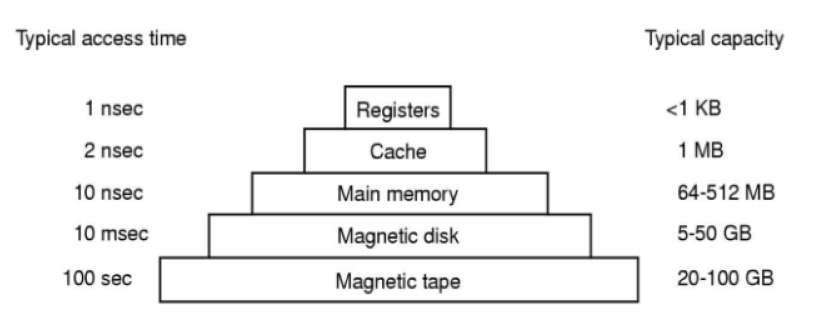

**MM** 包括：

-   **RAM**：用于接电时实际存储数据，掉电易失
-   **ROM**：存储 **BIOS（Basic Input/ Output System）**，掉电不易失

## 基本概念

-   **逻辑地址**：程序使用的地址形式（包括定义的指针值和对数据取地址得的地址值），为相对于本程序地址空间起始地址的偏址
-   **物理地址**：逻辑地址在内存中实际地址值

## 程序从源代码到内存中进程

>   1.  **编译**
>
>       用**源代码文件**【.c】生成**目标文件**【.o】（**目标模块**），每个**目标文件**有自己的逻辑地址空间（m个目标文件：0\~n~1~, 0\~n~2~, ... , 0\~n~m~）
>
>   2.  **链接**
>
>       把一组<u>目标文件</u>和用到的<u>库函数</u>**链接**成一个可执行文件【.exe】（**装入模块**），各**目标文件**地址空间也被重组成单个地址空间（0~N；将对应一个进程）
>
>       -   **静态** 
>
>           装入前就链接好完整的**装入模块**，之后作为整体一次性装入内存，不可拆开
>
>       -   **动态**
>           -   **装入时：**边装边链接（装入快）
>           -   **运行时：**运行到需要时才链接（如库函数，便于修改更新、共享目标文件<即多个程序可共享同一库函数>，省内存）
>
>   3.  **装入（load）**
>
>       进程开始运行前，在内存中**分配**进程使用的空间（即确定内存位置，但不一定进行地址映射<地址映射指把程序中的逻辑地址值引用都改写为物理地址值>），并把可执行文件内容等进程需要的数据**复制**到分配的空间
>
>       -   **绝对装入（无需重定位）：**物理地址=逻辑地址（无法实现多道程序）
>
>       -   **静态重定位装入（装入时重定位）：**装载时把<u>整个进程的内容</u>装入内存中<u>连续的一段</u>内，并<u>一次性进行所有指令中的地址映射</u>（把分配到的段的内存偏址值加到程序使用的所有地址值之上，<u>代码中使用的地址值被改写</u>），一旦进入过内存（程序使用的地址值已全部改变），运行过程中就只能待在原地（无法移到别处或增长）【<u>不可**交换**</u>】
>
>       -   **动态重定位装入（运行时重定位）：**装入时可以只装入进程部分内容就开始运行，同一进程不同部分在内存中位置可不连续，且运行过程中多次换出和装入到别处；装入时只是设置<u>基址寄存器（重定位寄存器）</u>、<u>界限寄存器</u>的值，而不改变程序使用的地址值（<u>保留逻辑地址，未映射/ “重定位</u>”，使得可以多次装入到不同物理位置）；
>
>           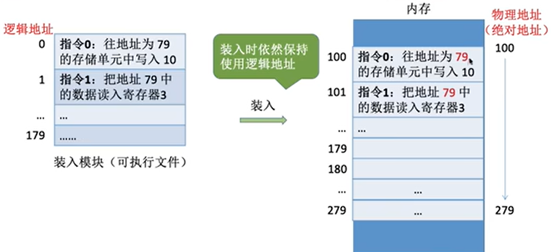
>
>           运行过程中（如运行到指令0，发现逻辑地址值79）指令需要**寻址**时，才进行<u>临时的地址映射</u>，即先比较逻辑地址值和界限寄存器值，若未超限则把逻辑地址值和基址寄存器值<u>相加得到物理地址</u>，用于定位，但依然<u>不修改指令中的逻辑地址值</u>，使得换出后再换入可移到别处、可动态申请内存【<u>可用于**交换**</u>】
>
>       -   **分页技术的装入（使用MMU映射）：**
>
>           **基本分页**在运行前装入整个进程，**请求分页**在运行中缺页中断时才装入所缺页面；映射时同样不会修改指令中逻辑地址值为物理地址值，只是用**MMU**和**慢/快表**进行 <u>逻辑地址 -> 页面号&页内偏移 -> 页框号&页内偏移</u> 的映射（具体见**分页**）
>
>   4.  **运行** 
>
>       只有<u>已装入内容才能被成功运行</u>，动态技术中运行到所缺内容触发的**中断**时，需要<u>装入所缺内容后重复执行</u>才能成功运行
>
>   ***装入和运行步骤的时机没有分明界限，是相互交织的！！！！***
>
>   
>

## 程序在内存中的管理

**管理事项**：

1.  **分配与回收**

    -   开始的进程分配到哪里？

    -   结束的进程怎么释放（回收）所占空间？

    -   怎么记录（跟踪）被占 & 空闲空间？

2.  **扩充物理内存（内存抽象技术）**

    使得只有运行当前进程必须使用的内容在内存中，其他的被淘汰，需要时再调入

    -   **覆盖技术**

        指**进程内程序段间的覆盖**

        

        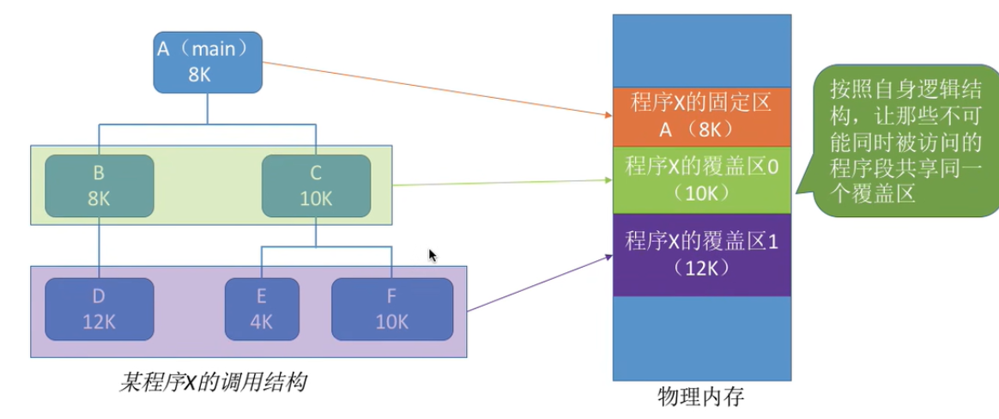

        **缺陷**：操作系统不知道各程序内部的调用结构，所以需要程序员在编程时就声明哪写程序段能共享同一覆盖区 =》<u>该技术对用户不透明，有编程负担</u>

    -   **交换技术**【能解决多进程总存储空间大于总内存的问题】

        指**进程间的交换**（交换的不一定是段或页！只是一种处理方法）

        

        换出时进程挂起，内存中内容移除，但**PCB**（记录了进程的磁盘地址）保留在<u>内存中挂起队列</u>里

        

        

    -   **虚拟内存技术（分页技术）**【能解决单个进程存储空间就大于总内存的问题】

3.  **实现地址映射**（静态、动态重定位/ MMU<分页专用>）

4.  **实现内存保护**（指防止进程访问的内存超过其占有的内存空间，即越界；例：基址寄存器 & 界限寄存器、页表寄存器）

    

### 分配与回收问题（和扩充物理内存的技术结合解决）

#### 1. 连续分配（指进程内连续，对内存分区，各区为一个进程）

>   ##### 单一连续
>
>   内存分用户区和操作系统；只能单道程序（运行完直接覆盖下一道）；<u>无外部碎片，有内部碎片</u>
>
>   ##### 固定分区
>
>   【初步解决无法并行的问题】
>
>   -   等大
>   -   不等大（比等大灵活些）
>
>   支持多道程序；<u>无外部碎片，有内部碎片</u>
>
>   ##### 动态分区
>
>   内存原来无分区，程序装入时需要多少分多少；支持多道程序；<u>有外部碎片（可内存紧缩但费时），无内部碎片</u>
>
>   **分配策略×5**：First/ Next/ Best/ Worst/ Quick；
>
>   **空闲区管理**：
>
>   -   **Bitmap**
>
>   -   **Linked list** 
>
>       4种更新情况：
>
>   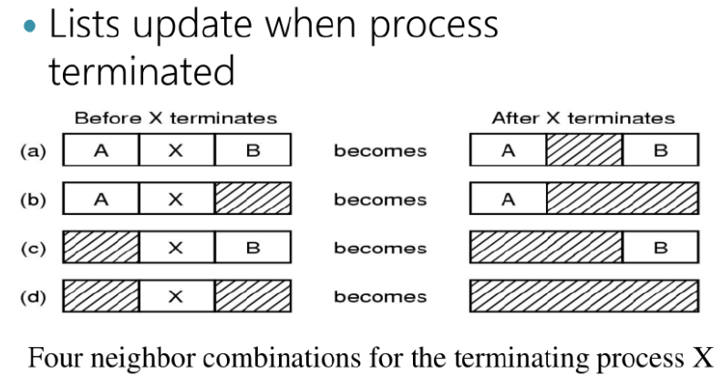
>
>   
>
>   ##### 多道程序系统 CPU 利用率计算
>   
>   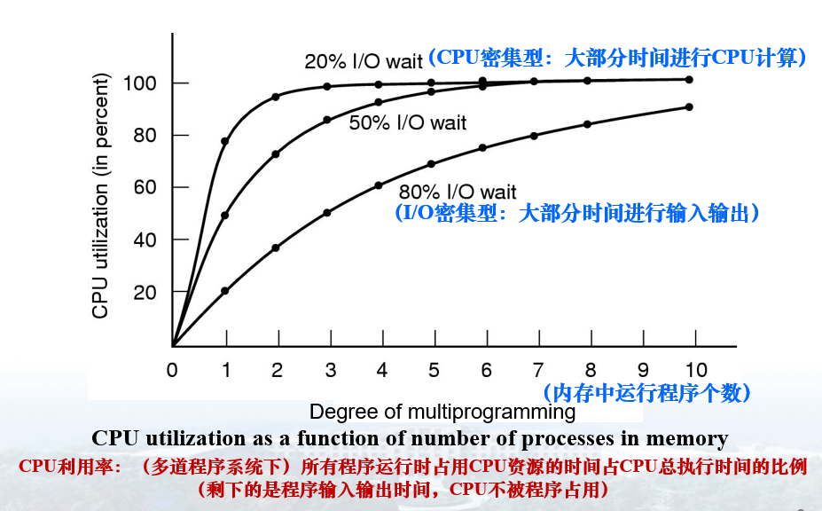
>   
>   （CPU总执行时间包括CPU在运行程序的时间和CPU等待I/O的时间）
>
>   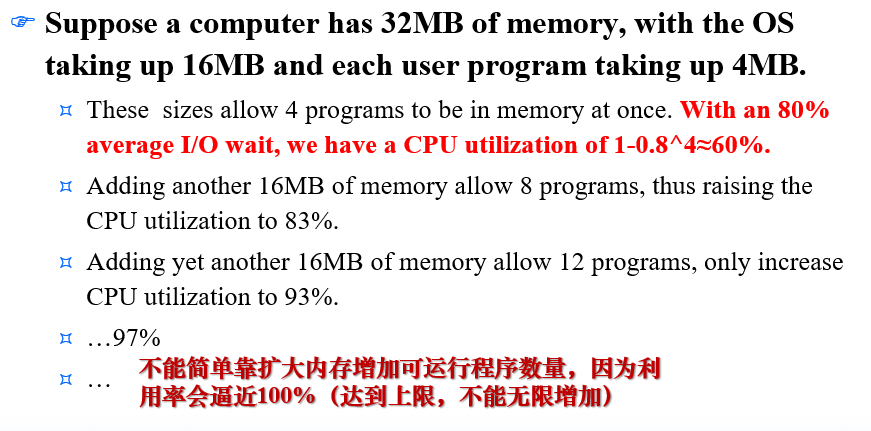
>
>   -   **CPU利用率** = CPU 执行非系统空闲进程的时间 / CPU总的执行时间 = 1 - 多道程序平均 I/O 率 ^程序道数^ 
>-   多道程序平均CPU利用率 = CPU利用率 / 程序道数 
>   -   平均每个程序的CPU时间 = CPU总的执行时间 × 多道程序平均CPU利用率
>
>   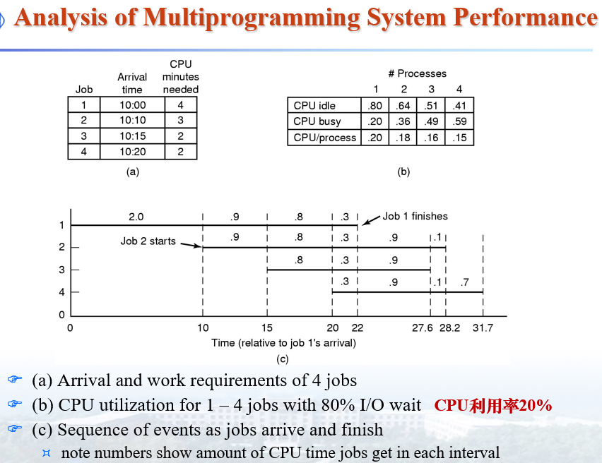
>
>   

#### 2. 分页

==*在内存存取一处数据要访存 2 次*==

>   ##### 基本分页
>
>   **性能**：<u>无外部碎片，有内部碎片</u>
>
>   **装入**：
>
>   不对内存分区，对程序划成**页面**，内存划成**页框**，运行前计算进程地址空间大小，进程完整地址空间的**页表**存到<u>内核空间</u>里（<u>必须用连续页框存放！</u>），<u>一次性把进程所有**页面**</u>装入（映射）到可能<u>不连续</u>的**页框**（<u>无缺页现象！</u>无工作集概念！），并设置**页表（Page Table，慢表，包含进程所有页面的页表项）**的值；
>
>   **页表项** = 页框号，按对应**页面**顺序排列；
>
>   **运行**：
>
>   某进程被调度时，把该进程的**页表**起始地址和长度提取到**页表寄存器**（所有进程共用，覆盖使用）；
>
>   运行到某个指令处需要**寻址**时，再用**MMU**（**内存管理单元**，CPU芯片的一部分，用于<u>输入页面号，输出页框号</u>）查询**页表**，完成<u>地址映射</u>，映射依据包括<u>**页表寄存器**内容 & **页表项**</u>，如下图【复习课本p111图、地址结构计算】
>
>   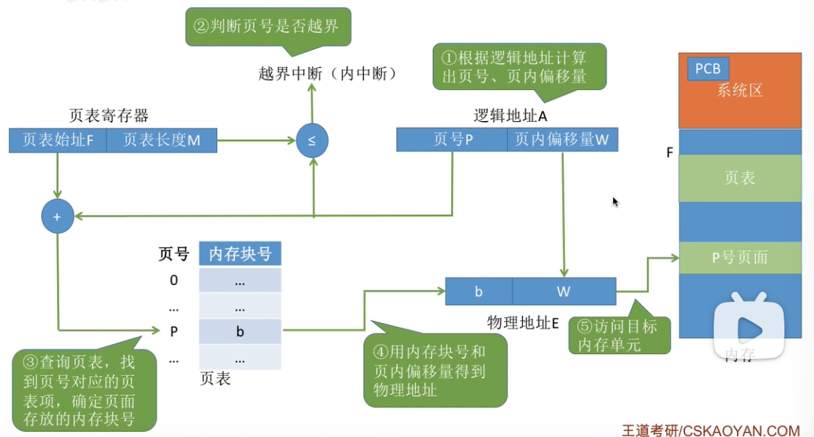
>
>   例题：
>
>   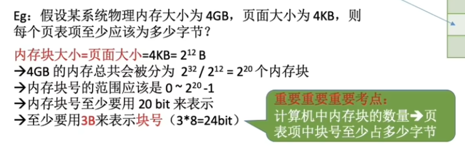
>
>   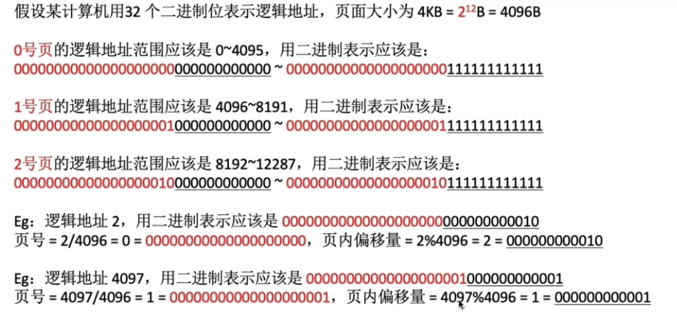
>
>   当开大小为2的整数次幂，可直接把虚拟地址拆成页号和页内偏址，而不用除法（求页号）和取余（求偏址）计算，生成物理地址时也可以直接拼接，而不用乘法（求页框基址）和加法（加偏址），性能提高：
>
>   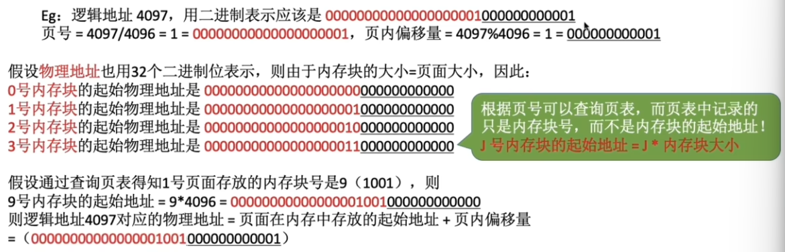
>
>   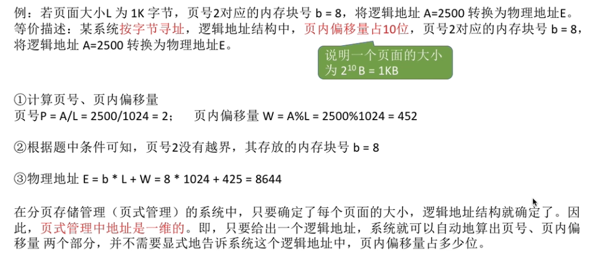
>
>   
>
>   ##### **请求分页**
>
>   *（在基本分页基础上，新增<u>请求调页</u>功能 & <u>页面置换</u>功能）* 
>
>   **装入**：
>
>   缺页时才真正装入页面，进程开始运行前只是计算进程地址空间大小，并载入进程**PCB**和**页表**到<u>内核空间</u>；
>
>   **运行**：
>
>   **页表项** = 页框号 + “在/不在”位 + 修改位（脏位，M位）+ 访问位（R位；页面置换算法用到）+ 保护位 + **页面**<u>磁盘物理地址</u>（用于写回，**页面**不在内存时无该项，其磁盘物理地址放在操作系统软件表格中，MMU不需要），按对应**页面**顺序排列 ；
>
>   当 **MMU** **寻址**到某**页表项**“在/不在”位为0时（<u>第一页必缺页</u>），使进程发出**缺页中断**请求调页，CPU<u>陷入操作系统</u>（在PC更新为内核指令前将原值保存到**PCB**），操作系统<u>找到一个空**页框**</u>或<u>置换一个**页面**</u>（脏则写回，否则丢弃；仅释放内存，不移除**PCB**和**页表**），设置**页表项**，将被请求**页面**装入，然后（复原PC的值）<u>重新执行</u>调入的页面；
>
>   当 **MMU** **寻址**到某**页表项**“在/不在”位为1时，和**基本分页**一样完成<u>地址映射</u>；
>
>   **页面置换算法（PRA，Page Replacement Algorithm）**：（复习课本p118-p120）
>
>   <u>Optimal/ NRU/ FIFO/ Second Chance/ Clock/ LRU（用链表精准记录各页面访问次序<包括同一时钟内>，可无限记录）/ NFU（仅记录各页面累加访问次数而丢失时间次序信息，可无限记录）/ Aging（用右移和加法记录个页面在不同时钟间的访问次序而丢失同一时钟内次序信息，仅有限记录）</u> 
>
>   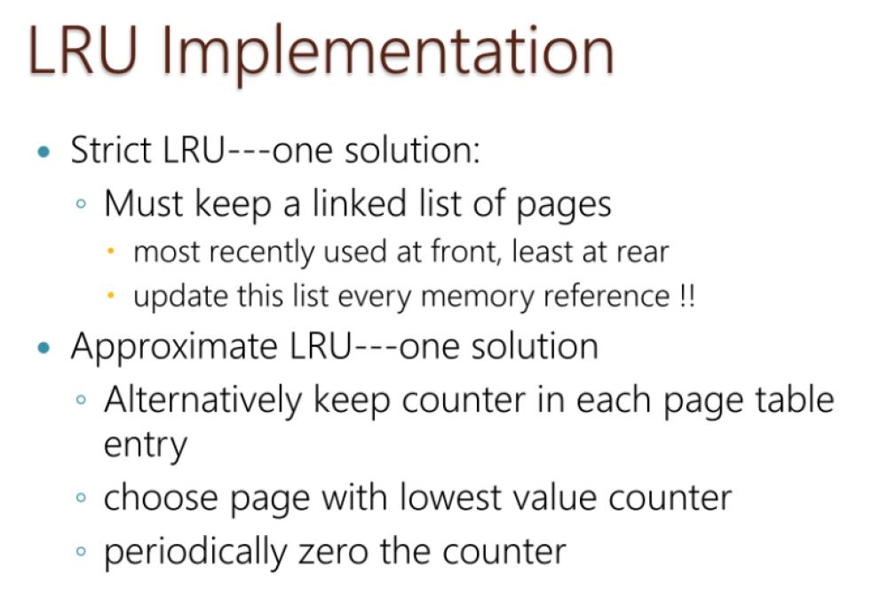
>
>   
>
>   ##### 预先调页
>
>   关于**驻留集**和**工作集**：
>
>   （<u>“窗口尺寸”</u>即工作集算法中移位寄存器的大小）
>
>   
>
>   预先调页同样是只把进程的<u>部分**页面**调入内存</u>，但不是等到运行到缺页时才调入，而是根据特定算法预测某时刻的**工作集**（内容随运行时间演变），据此随运行时间动态调整**驻留集**内容，使得运行到某时刻前就保证其**工作集**已在内存中（<u>理想情况</u>不会出现中断<虽然很难有理想情况>，但请求调页必须有中断）
>
>   **页面置换算法**：（复习课本p121-p123）
>
>   （**工作集**是各个进程私有的，不宜用全局策略）
>
>   <u>WS（工作集页面置换）/ WSClock（工作集时钟页面置换）</u> 
>
>   
>
>   ##### 页面置换策略
>
>   （看课本复习）
>
>   -   **局部** —— 各进程内存中**驻留集**大小<u>固定</u>，页面置换范围为本进程驻留集
>
>       问题：<u>进程的常用页面集（**工作集**）大小可能大于被分配**驻留集**大小</u>，导致发生频繁缺页，刚换入的页面极易很快又被换出 =》**颠簸现象（Thrashing）** 
>
>   -   **全局** —— 各进程内存中驻留集大小<u>可变</u>，页面置换范围为所有已调入进程驻留集
>
>       问题：不适用于进程<u>驻留集大小固定</u>或<u>驻留集由该进程运行特点确定（如使用**工作集**时）</u>的算法（*因此无法用全局策略解决工作集颠簸现象，只能<u>多分配点驻留集</u>*）
>
>       
>
>   ##### 加速分页技术
>
>   **TLB（Translation Lookaside Buffer，转换检测缓冲区/ 相联存储器/ 快表）**
>
>   一种集成在**MMU**上的硬件缓存设备，不用访存且比内存快！所以把最近常用页面（不能全部页表都放**TLB**，因为**TLB**很贵，储量小）<u>在**TLB**中存一份副本</u>（**TLB**中的页面一定也在**页表**中），**寻址**时<u>先查询**TLB**</u>（查询方法和查询**页表**相同）；若**TLB**中没有，也不会缺页，只是<u>继续查询**页表**</u>，后续操作和一般的**页表**查询（包括缺页情况）一样，最后再<u>从**TLB**置换掉一个**页面**</u>，在页表中<u>更新它的脏位（如果脏了）和访问位（清零）</u>，<u>换入</u>被**寻址**的原本不在其中的**页面** 
>
>   
>
>   ##### 大页表处理技术
>
>   ###### 多级页表
>
>   
>
>   （没有必要让整个页表常驻内存，所以也给页表分页<其实是给页表项分组>，并只把运行进程必要的组编入顶级页表<页表组的目录；原页表组成为二级页表>，这样就可以给可能在原完整页表中非连续页表组编号，用顶级页表组织起来访问）
>
>   **分页**的“套娃”：**（二级）页表**是进程地址空间的页表，**顶级页表**是**页表**的页表
>
>   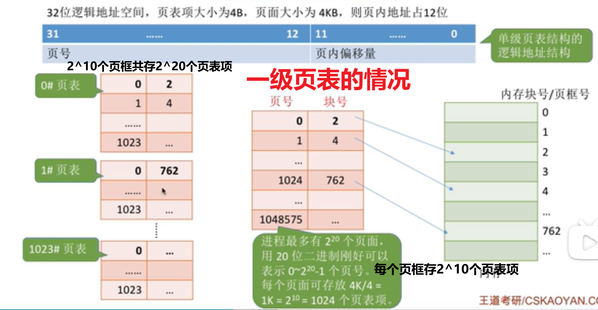
>
>   **双级页表**见课本p115（原地址空间为2^32B<但运行进程实际只用12MB>，12MB中每4MB对应的页表项为一组作为二级页表<12MB为其中的3组>）
>
>   ***级数越多，灵活性越大！***
>
>   ###### 倒排页表
>
>   （看课本p116的图）
>
>   多级页表级数爆炸 =》用倒排页表使页表项数减少：<u>以**页面号**为页表项内容，按**页框**顺序排列，每个进程不再有自己的**页表**，整个内存用单张**页表**</u> =》查找某页表遍历时间长 =》<u>用 **TLB** 继续减少查找项数</u> =》**TLB** 失效时查找时间长 =》对倒排页表继续改进：进行<u>用链表解决冲突的散列</u>，<u>以**虚拟地址**为键得到哈希值，作为索引</u>，表项内容是**页面号**和**页框号**组成的结点（哈希值冲突时连成链表；依然是整个内存一张**页表**，不同地址空间相同虚拟地址的结点链接到同一链表上，以结点中不同的**页框号**作为区分）
>
>   
>
>   ##### 最佳页面大小问题
>
>   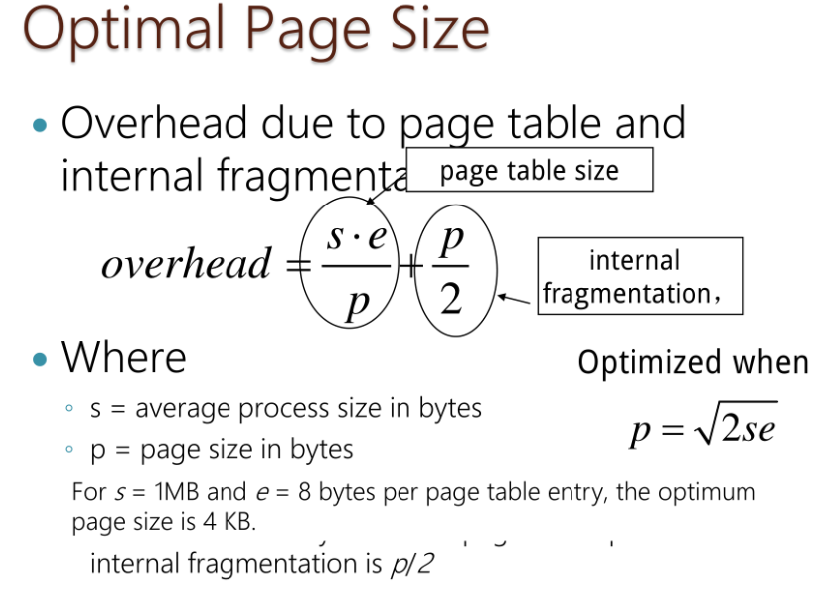
>
>   
>
>   ##### 共享页面（共享内存的实现）
>
>   1.  先把进程分为 **I 空间（指令地址空间）** 和 **D 空间（数据地址空间）**，两空间可**独立分页**，有各自的**页表**<u>（同时解决了系统地址位数不够<受硬件限制>，使得单个地址空间放不下所有指令和数据的问题）</u>
>
>   2.  （一般只读内容才可共享，如指令\<如shared library库文件>）进行**代码共享（Code Sharing）**：不同进程的 **I 空间** 共用一个**页表**，使得来自<u>不同地址空间的相同编号**页面**可映射到相同**页框**</u>，实现该**页框**内容的共享
>
>   3.  另一种不用分离地址空间也不用同一页表共享方法：<u>映射函数能把不同进程的虚拟地址映射到同一物理地址（被共享地址）</u>，这样可以将不同地址空间不同的虚拟地址映射到同一物理地址
>
>       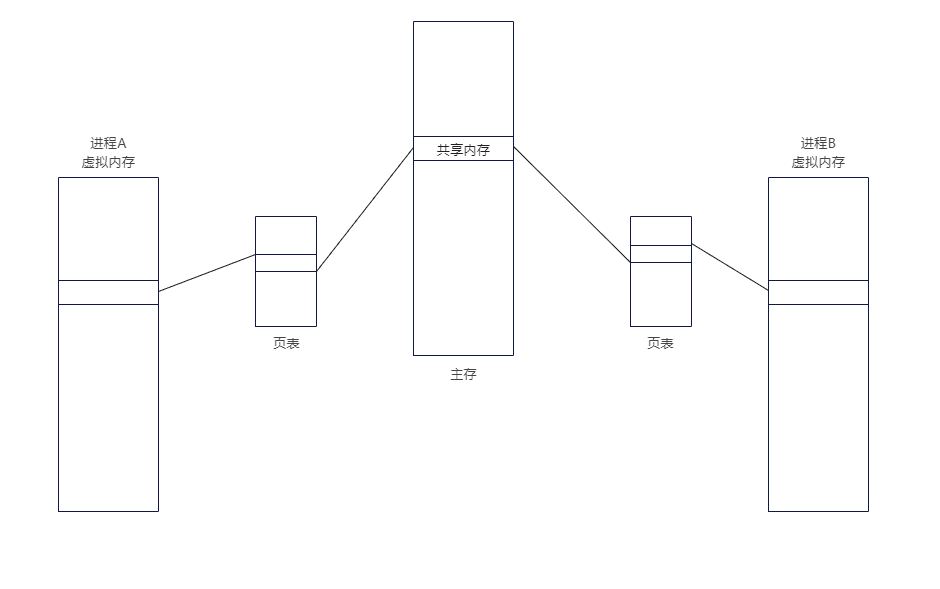
>
>       
>
>   ##### 分页技术的工作时机 
>
>   （复习课本p131）
>
>   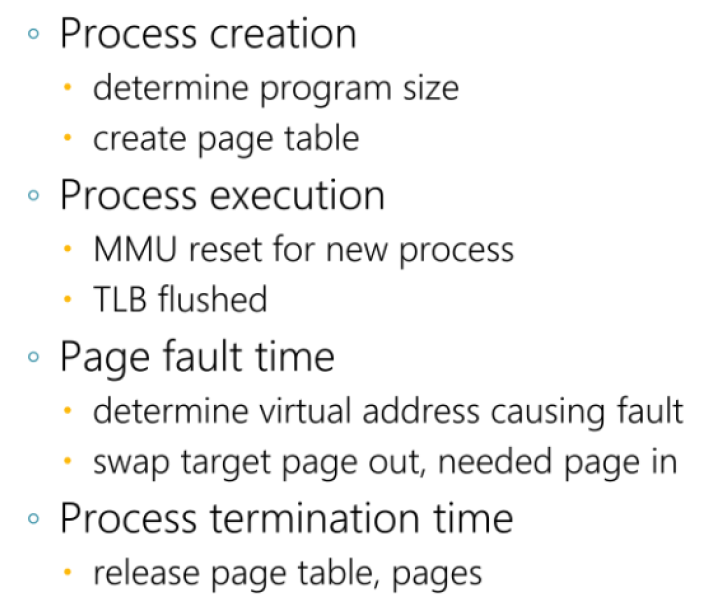
>
>   
>
>   ##### 缺页中断处理过程
>
>   （复习课本p131）
>
>   

#### 3. 基本分段（二维地址空间）

==*在内存存取一处数据要访存 2 次*==

>   不对内存分区，对程序分段（各段有独立地址空间，利于内存共享和动态增长），使用段表把逻辑段映射成物理段；有外部碎片（<u>类似进程动态分区</u>），无内部碎片
>
>   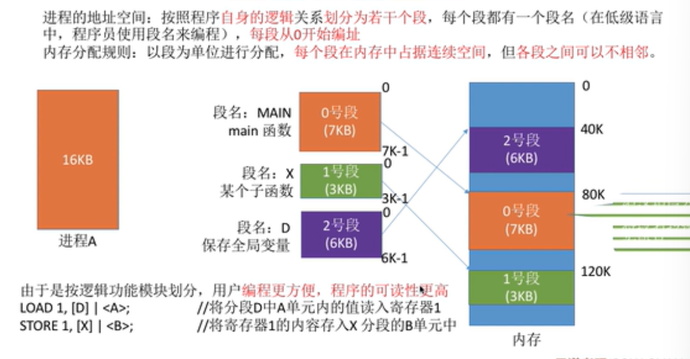
>
>   （段表类似于页表，段表项比页表项多了段长，因为各段长度不同）
>
>   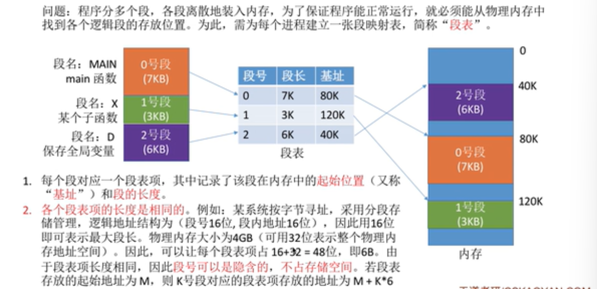
>
>   **分段和分页的对比：** 
>
>   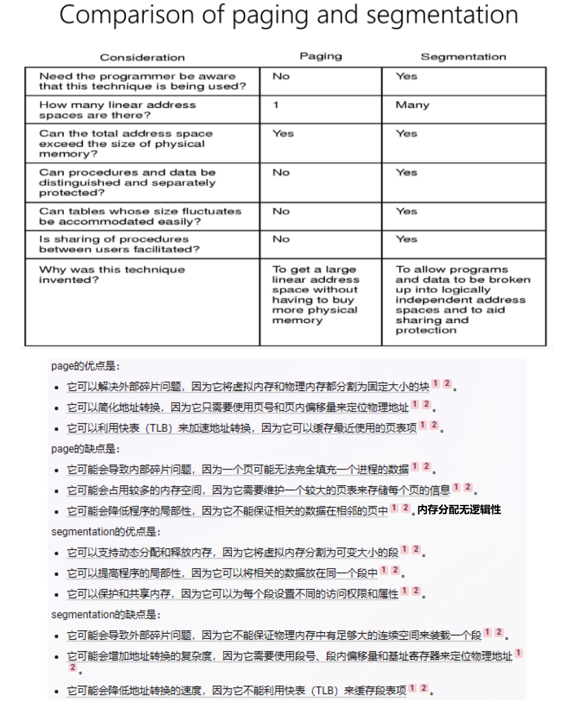

#### 4. 段页式（二维地址空间）

==*在内存存取一处数据要访存 3 次*==

>   （看课本p136-p140）
>
>   不对内存分区，对程序在逻辑地址空间分段，在内存分页（内存划成页框），使用段表把逻辑段映射到逻辑段页表，页表再把逻辑页面映射到物理页框；无外部碎片，有内部碎片
>
>   

***有虚拟内存的系统才能采用请求策略，才能以段/ 页为单位换入换出！！！否则只能预先装入进程的所有段/ 页面！！***

## 后备存储

看课本p133

