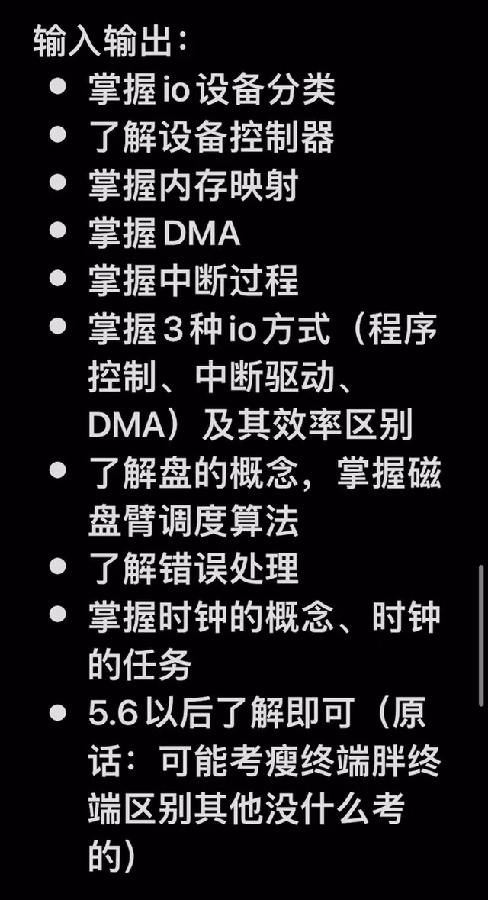
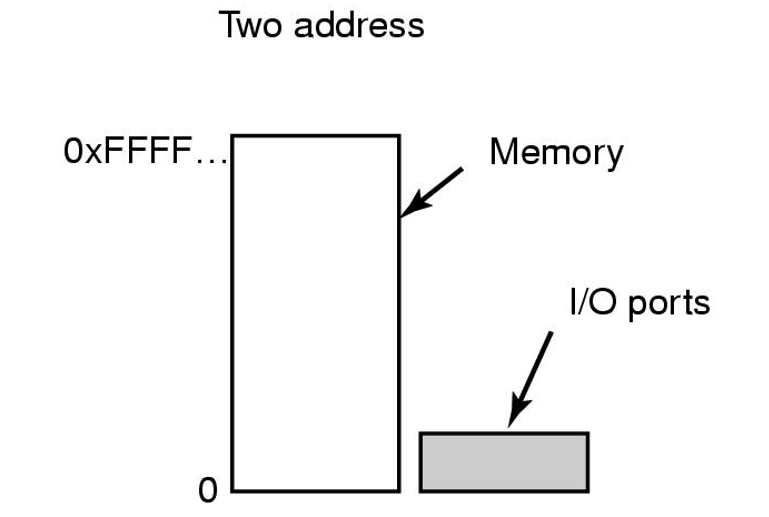
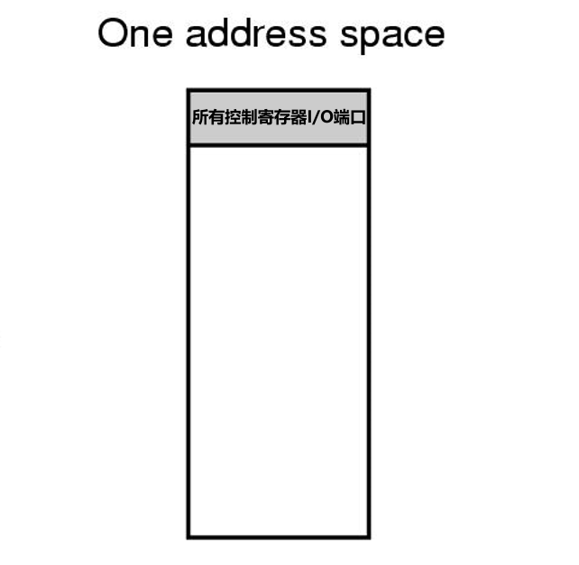
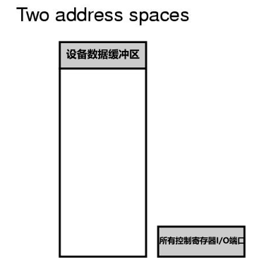
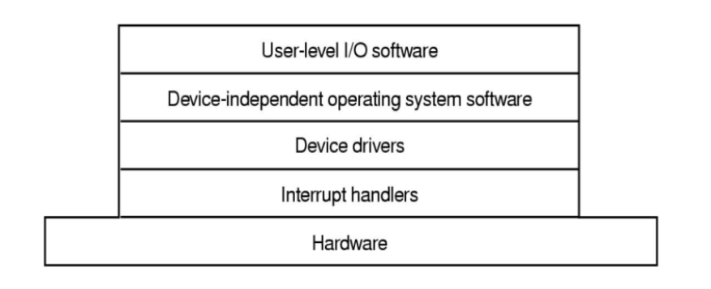

# ch5 输入 / 输出

## 操作系统I/O 控制目标

*（即I/O软件设计目标）*

-   向设备<u>发送命令</u>（到**控制寄存器**）
-   <u>捕捉</u>设备<u>中断</u>（I/O结束时）
-   <u>处理</u>设备的<u>错误</u>
-   实现接口的<u>设备无关性（Device independence）</u>：在设备和系统的其他部分（软件，如用户进程）之间提供简单易用的接口，并尽量统一接口（即<u>使得不同设备的用户操作接口相同</u>，方便用户用相同接口操作任意设备）

## I/O 设备分类

-   **块设备（Block Device）**

    分为大小固定的块（块内连续存储），以单个完整块为单位读写；

    <u>可寻址</u>；

    例：磁盘、磁带

-   **字符设备（Character Device）**

    以字符为单位读写字符流；

    <u>不可寻址</u>；

    例：打印机、键盘、鼠标、网络接口

-   **时钟**

## I/O 设备构成

-   **机械部件** —— 设备本身
-   **电子部件（芯片）** —— 设备**控制器**/ **适配器**
    -   （多个）**控制寄存器**
    -   **内部缓冲区** —— **控制器**组装**字节块**的场所
    -   （永久的）**存储器**
    -   **数据缓冲区** —— 操作系统/ 用户进程写入数据的场所（通常<u>在永久**存储器**中</u>）

## 设备控制器（Device Controller）

**本质**：**I/O设备**的上的<u>电子部件（芯片）</u>

**功能**：

-   装有多个**控制寄存器**，用于：① <u>接收</u>操作系统对设备的<u>指令</u>；② 为操作系统<u>保存设备执行状态</u>

-   装有**内部缓冲区**

-   主要任务：

    1.  在<u>**内部缓冲区**</u>中把**位**组装成**字节块**；

        （<u>**字节块**：以**字节**为**最小寻址单位**的存储块，大小不一定！</u>）

    2.  计算校验和，进行<u>校验</u>以保证字节块组装无错；

    3.  发出中断，让操作系统一次次把**字节块**<u>复制到内存</u>（使用**DMA**可改进）

**优势**：程序员不用对**I/O设备**显式编程，只需<u>对**控制器**设置参数</u>即可控制设备的驱动

## 内存映射

**设备控制器**通过每个**控制寄存器**的一个**I/O端口**和**CPU**通信（每个I/O设备的**控制器**中有<u>多个寄存器</u>），一个设备的所有**I/O端口**的端口号形成<u>I/O端口空间</u>（类似地址空间，只有操作系统可以访问），不用内存映射时，访问I/O设备的<u>指令中要明确指定I/O端口号</u>（和内存寻址类似）

使用**内存映射**时，有两种方案：

-   把所有**I/O端口**映射到内存空间（通常在高地址处），<u>每个**控制寄存器（I/O端口）**分配唯一内存地址</u>

    

-   把设备的**数据缓冲区**映射到内存空间，**I/O端口**仍在<u>I/O端口空间</u>

    

**优势**：

-   **设备控制器**成为内存中的变量，方便程序员编写设备驱动（不是用户进程）时<u>用C语言内存引用写**寻址**指令（取地址）</u>，否则需要<u>使用汇编语言指定端口号</u>
-   一般指令（如用于运算数据的指令）也可以<u>直接对I/O映射到的内存地址（取内容）使用</u>，而无需先把I/O缓冲区数据读到内存再运算，或把指令发送到控制寄存器中再控制设备执行
-   只用防止<u>虚拟地址</u>被映射到<u>I/O内存映射空间</u>即可简单实现保护（防用户进程执行I/O）
-   可以把不同**I/O设备**分开存放在不同**页面**，**页表**的不同**页表项**也对应不同**设备**，方便程序员编写设备驱动时可以<u>以**页面**为标识指定**设备**</u>，进而可对不同**设备**编写单独的设备驱动并<u>放在不同地址空间（不同进程）</u>，<u>减小了内核大小</u>（分开的设备驱动可放在不同内核模块），也<u>防止了设备驱动间互相干扰</u>

**缺陷**：

-   <u>操作系统</u>必须管理<u>硬件</u><u>选择性禁用映射**页面**的高速缓存</u>，否则会出现**I/O设备**存储的数据（不是缓冲区和寄存器，有别的永久存储器）和<u>内存高速缓存数据</u><u>不同步</u>的问题
-   内存和**I/O设备**都需要检查所有内存引用（对内存的寻址），<u>判断是真实内存空间地址还是I/O映射空间地址</u>，再作出响应，检查方式根据<u>不同总线结构</u>有较复杂的区别，详见课本p192

## 直接存储器存取（Direct Memory Access，DMA）方案

增加一个硬件**DMA控制器**，独立于**CPU**和内存访问总线，调控多个设备的数据传送，以实现<u>**内部缓冲区**到内存的复制不用由**CPU**亲自控制、由操作系统执行，解放**CPU**</u> 

**模式一：飞越模式（Fly-by Mode）**

1.  **CPU**对**DMA控制器**设置参数（内存地址、字节数、指令、I/O端口号、传送方向、传送单位......），<u>此后**CPU**已解放</u>
2.  **DMA控制器**通知**I/O设备**把数据放到控制器<u>内部缓冲区</u>，并进行<u>校验</u>
3.  **DMA控制器**对**I/O设备**发出读请求（**I/O设备**接受到的请求和**CPU**发出的没有区别），把写入的<u>内存地址送到总线地址线</u>，**I/O设备**从**内部缓冲区**<u>读出一个字节送到总线数据线</u>，<u>总线</u>根据内存地址和数据<u>写内存</u>（无需操作系统设置地址和数据）
4.  **DMA控制器**<u>步增内存地址、步减字节数</u>，字节数大于0时回到第3步
5.  **DMA控制器**中断**CPU**，通知其<u>I/O已完成</u>，此时操作系统才开始工作

**模式二：I/O设备先把数据传给DMA控制器，DMA控制器再用总线传到别的地方**（**DMA控制器**起<u>中转作用</u>）

## I/O 中断过程 

硬件：**中断控制器**

1.  （多个）<u>设备</u>（完成工作时）在总线上<u>置起信号</u>，被**中断控制器**（<u>独立于**CPU**同总线通信</u>）检测到
2.  **中断控制器**<u>先服务优先级高的</u>设备中断（其他的请求挂起到一个队列）：在总线<u>放置被服务设备的标识数字</u>，并置起<u>中断**CPU**的信号</u>
3.  **CPU**暂停当前工作，<u>响应/ 处理中断</u>

## I/O 软件原理

### I/O 软件目标

-   **设备独立性**

-   **统一命名** —— 和文件命名和路径寻址方式统一（被当作文件安装\<Mount>到文件系统），为一个字符串或一个整数，命名规则不依赖于设备

-   **错误处理** —— 处理层次：设备**控制器**本身 -> 驱动程序 -> 更高层软件（<u>*低层无法处理才交给高层*</u>）

-   **实现同步或异步**：

    -   **同步**：指某进程需要I/O时，该<u>进程阻塞</u>（**CPU**交给其他进程），直到该进程I/O结束（<u>缓冲区准备好</u>），**CPU**<u>继续执行该进程</u>【**同步**指需要I/O的进程其缓冲区的准备与后面的工作以线性顺序进行，必须等待结果！】

        =》用户程序无需控制I/O细节

    -   **异步**：指某进程需要I/O时，该<u>进程发出中断</u>，**CPU**在内核<u>启动设备</u>的工作（指发送传输指令到控制器）后立即返回用户空间，并<u>继续执行该进程后续工作（不阻塞该进程）</u>，直到<u>设备发出中断</u>（表示I/O完成），**CPU**再<u>处理准备好的缓冲区</u>【**异步**指需要I/O的进程其缓冲区的准备与进程后续工作交叠进行，不等待结果，而接受稍后通知（即中断）！】

        =》由于I/O不被其他工作等待，后续工作的代码中需要专门控制I/O细节

-   **解决缓冲问题**：

    -   **数据检查**：离开设备的数据不能立刻被写入最终目的地，需要<u>在计算机中设置一个缓冲区作为操作系统检查数据的场所</u>（检查完才知道最终目的地）
    -   **实时传输**：设备被约束必须在极短时间内完成一批数据的传输时，缓冲区清空速率较高，且不允许传输过程有中断（保证原子性），于是应防止<u>缓冲区欠载（Buffer Underrun，指缓冲区填满速率<清空速率，导致时间间隙中缓冲区空白，会造成中断）</u>，即<u>需要先把所有要传输的数据在缓冲区准备好</u>，再开始传输

-   **解决共享和独占问题**：有的设备允许<u>共享</u>（如<u>磁盘、打印机<使用SPOOLing技术></u>）而有的只能<u>独占</u>（如<u>磁带</u>）；独占型设备需要解决<u>死锁问题</u>

### 3 种 I/O 软件实现方法

#### 程序控制I/O

1.  用户进程在用户空间缓冲区组装好待打印字符串
2.  用户进程发出<u>打开打印机的系统调用</u>（阻塞直到打印机可用）
3.  （可用打印机后）发出<u>让操作系统控制打印机打印字符串的系统调用</u>（打印时CPU陷入操作系统）
4.  操作系统将用户空间字符串复制到内核数组
5.  开始打印/复制（打印机可能先缓存一页再打印，所以先把内核数组复制到打印机缓冲区）一个字符时，打印机控制器设置状态寄存器为非就绪
6.  CPU忙等待字符的打印，直到打印机控制器将状态寄存器设为可用（表示当前字符已打印完），再调度操作系统控制下一字符的处理

***缺陷：CPU忙等待浪费时间（状态寄存器的设置无法实现CPU解放后再召回）***

****

#### 中断驱动I/O

1.  用户进程在用户空间缓冲区组装好待打印字符串
2.  用户进程发出打开打印机的系统调用（阻塞直到打印机可用）
3.  （可用打印机后）发出让操作系统控制打印机打印字符串的系统调用（打印时CPU陷入操作系统）
4.  操作系统将用户空间字符串复制到内核数组
5.  开始打印/ 复制时，**CPU阻塞当前打印进程**
6.  开始处理一个字符时，**CPU去调度别的用户进程**
7.  当打印机发出**中断**（表示当前字符已打印完），CPU再保存另一个进程状态并挂起，执行打印机**中断处理服务：**<u>若还有字符没处理完，CPU调度操作系统控制下一字符的处理，然后返回另一进程；否则，CPU解除当前打印进程的阻塞，继续执行其打印操作后面的任务</u>

***优势：CPU无需忙等待，使用中断实现先解放CPU再召回 =》中断次数=字符个数*** 

****

#### 使用DMA的I/O

1.  用户进程在用户空间缓冲区组装好待打印字符串
2.  用户进程发出打开打印机的系统调用（阻塞直到打印机可用）
3.  操作系统将用户空间字符串复制到内核数组
4.  （可用打印机后）发出让操作系统控制打印机打印字符串的系统调用（打印时CPU陷入操作系统）
5.  **CPU对DMA控制器设置参数，然后去调度别的用户进程**
6.  **DMA控制内核到打印机全部的字符串处理过程**
7.  <u>当前内核缓冲区全部处理完</u>，**DMA控制器发出中断**，CPU解除当前打印进程的阻塞，继续执行其打印操作后面的任务

***优势：使用DMA和中断实现CPU先解放再召回，同时节省了大量中断时间 =》中断次数=要处理的内核缓冲区个数***

***问题：DMA控制器比CPU慢很多，当DMA控制器不能全速驱动设备或CPU被解放时没有其他任务，则前两种控制方法会更好***

### I/O 软件层次

内核空间中层次：设备独立操作系统（内核） > 设备驱动程序（内核模块） >

中断处理程序

## 盘

看课本，重点掌握磁盘调度

## 时钟

### 每个时钟脉冲的任务

看课本p219-p221

1.  维护<u>日时间</u>（实际时间）
2.  <u>防止</u>任何进程运行<u>超时</u>（更新时间片个数）
3.  对<u>CPU使用情况记账</u>（记录每个进程占用CPU的有效执行总时长）
4.  处理用户进程发出的<u>alarm系统调用</u>（更新报警计数器）
5.  作为操作系统各部分的<u>监视定时器</u>（防止死机，超过某限制直接终止，类似2.）
6.  剖析，收集监视&统计信息

### 软定时器

看课本p221-p222

## 终端

### X窗口系统

X客户（远程计算服务器内的用户程序）与X服务器（用户计算机内）分离，通过网络中的X协议通信；使得整个X系统高度可移植、高度灵活

### 瘦终端/ 瘦客户机（SLIM）

多个客户机共用一个或几个中心服务器；中心化系统利于保密、保护&共享资源且降低成本

## 电源

耗电顺序：显示器（通过降低分辨率和成色省电） > CPU（通过降压运行省电） > 硬盘（通过平时保持低速旋转、需要时才加速至高速来省电） > ...... > 内存（通过先刷新再关闭高速缓存<其实是睡眠，需要时可很快重新加载>省电） > ......
