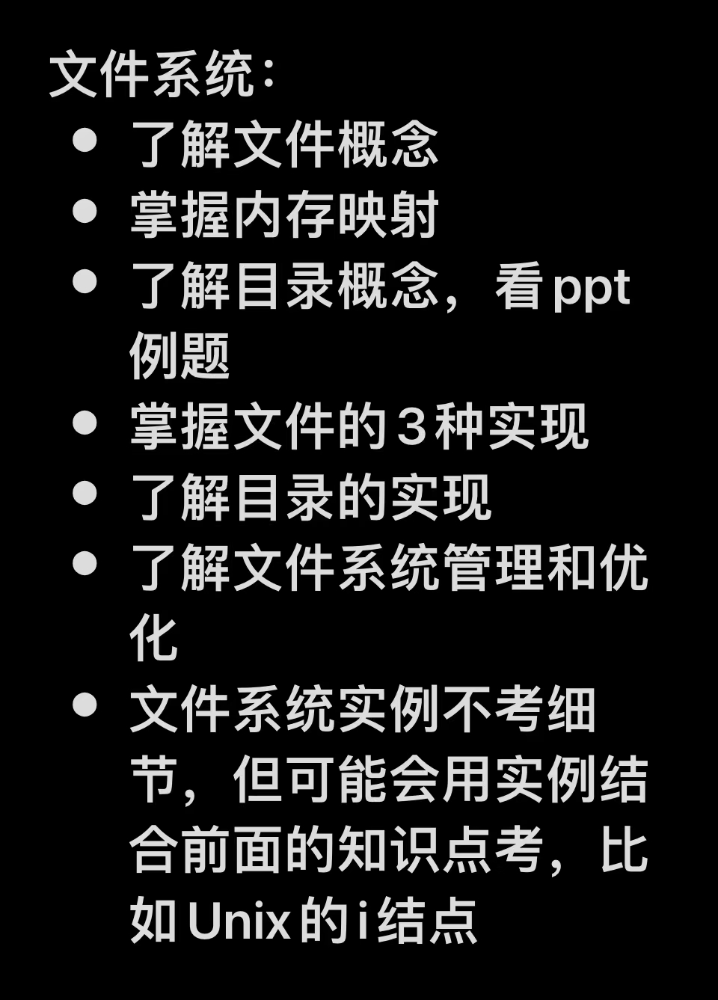
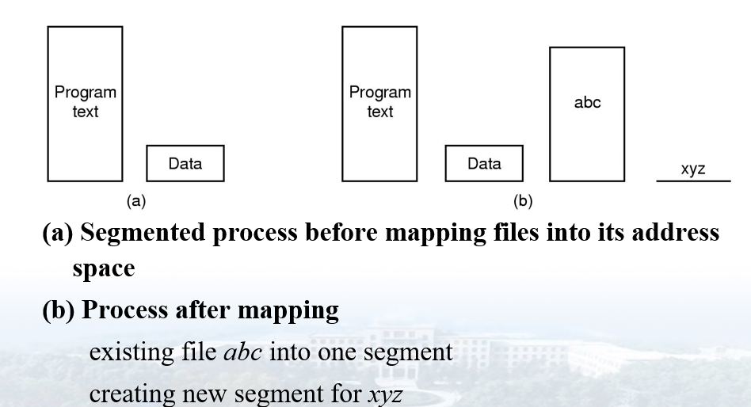
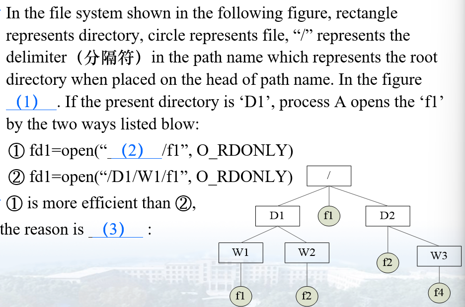
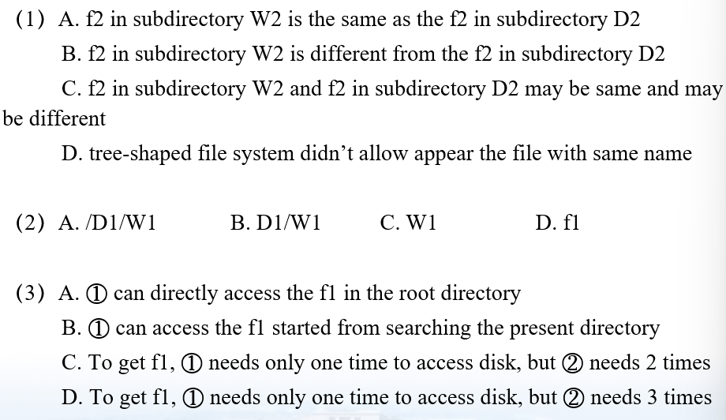
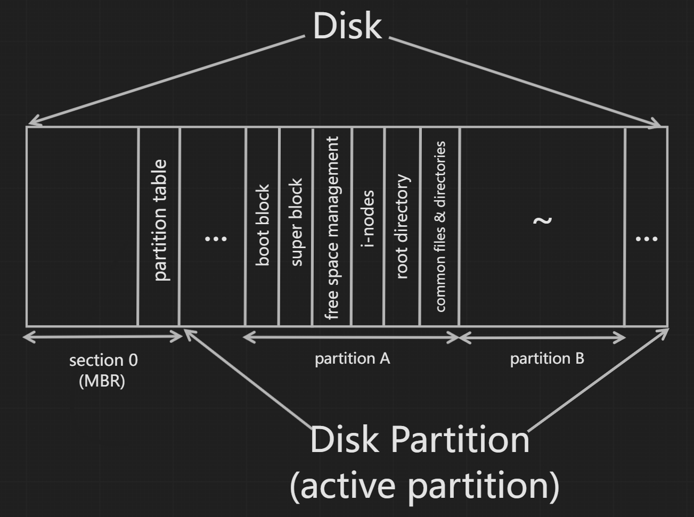
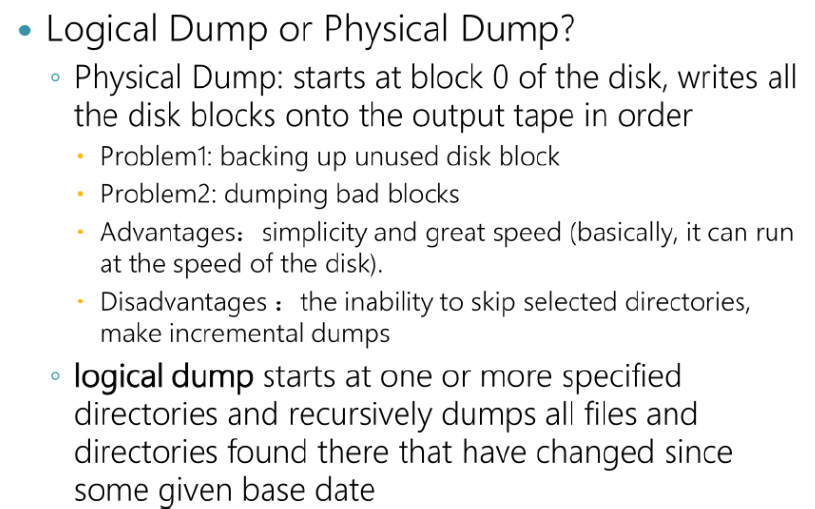

# ch6 文件系统

## 目标

-   存储量大
-   进程终止不易失
-   多进程能并发访问

**解决方法**：

1.  以**文件**为单元存储在任何存储设备
2.  存储在数据库（读取速度更快，方便频繁读取）

## 文件基本概念

-   一种**抽象机制**，使用户不用知道存储信息、位置、磁盘工作方式等细节，就可以保存、打开或修改文件
-   **文件名**是面向<u>用户</u>的，提示内容、文件类型，加速人为检索；还是面向非操作系统软件的，扩展名（文件类型）提示可不可以在进程中使用；此外，操作系统至少能识别自己会用到的可执行文件类型
-   操作系统看到的文件只是**字节**，和文件的内部结构

## 文件分类

-   按用途：

    -   系统文件
    -   用户文件
    -   库文件

-   按数据格式：

    -   源文件

    -   目标文件

    -   可执行文件（exe）（二进制文件）

        有文件头：以魔数开始（用于区分某些文件类型），后面依次是正文、数据、BSS、符号表的长度（用于重定位时载入界限寄存器）和入口点；文件具体内容即正文、数据、符号表，还有重定位位（规定重定位方式和位置）
        
    -   存档文件（archive）（二进制文件；是已编译未链接的打包目标文件，分模块存储）

        其中有多个模块，每个模块有模块头：以模块名称开始，后面依次是日期、所有者、保护码、文件大小；每个模块除了模块头就是目标模块内容，里面包含一组彼此相关的目标文件内容

-   按访问权限：

    -   只可执行文件
    -   只读文件
    -   可读可写文件

-   按逻辑结构：

    **逻辑结构**指文件<u>内容组织结构</u>

    -   结构化文件

        可以有数据项（记录）；用户可查询某内容的位置；以块存储；行式文本，各行列数相同（如表格文件、.doc）

    -   非结构化文件（如二进制文件，即乱码，“流式文件”，还有.txt，图片文件）

-   按读写单位：

    -   字符特殊文件

        用于字符型设备I/O（如串口、终端、打印机）

    -   块特殊文件

        用于块型设备I/O（如各种盘）

## 3种文件逻辑结构

-   字节序列：单纯地把文件内容按实际顺序排成字节序列，用户容易增、删、改
-   记录序列：把字节按记录分块，记录内有特殊的字节组织结构，用户读写文件时都只能以记录为单位操作
-   记录树：记录内有多个键和多个指针，键内容有序（比如按ASCII顺序），指针指向记录的孩子记录，所有孩子记录中的键内容整体有序

## 文件访问

从设备视角：

-   **顺序**：磁带比磁盘更便于顺序访问
-   **随机**：磁带不能随机；磁盘支持随机，但顺序仍比随机快；数据库系统必须支持随机

文件自身也有访问顺序限制标志！

## 文件属性

**常用的：**创建者、所有者、只读标志（0=可读可写，1=只读）、随机访问标志（0=只顺序，1=可随机）、创建时间、最近访问时间、最近修改时间、当前大小（字节数）、最大长度（允许的最大字节数）

## 文件操作

**本质：**系统调用函数，见课本p152

create/ delete/ open（把文件属性和磁盘地址表装入内存）/ close（把最后一个文件内存块写回磁盘文件，并释放内存中磁盘地址表所占空间）/ read/ write（覆盖时被覆盖内容会永久丢失）/ append/ seek/ get attributes（获取文件属性）/ set attributes（让用户在创建文件后设置文件属性）/ rename

## 内存映射

把<u>磁盘文件</u>物理地址映射成<u>进程地址空间</u>逻辑地址，相当于<u>把磁盘文件连接到进程内容，成为进程的一部分</u>，进而在进程运行时，随进程逻辑地址一起映射到内存物理地址，加速进程使用文件

## 目录基本概念

-   **当前目录（工作目录）**：每个进程都有自己的当前工作目录，切换目录和进程退出时，其他进程不会受影响

-   **绝对路径**：**<u>开始有"/"</u>**（*该"/"代指根目录bin*），后面跟<u>完整路径（根目录以后的）</u>上的目录序列

-   **相对路径**：<u>**不用"/"**</u>，直接是<u>当前工作目录以后</u>路径上的目录序列；可使用"."表示当前工作目录（一般用于把另一目录文件复制到当前目录：**cp <另一目录文件路径> .(表示当前目录)**）；可使用".."表示当前工作目录的上一级目录（父目录）（一般用于访问处于同一父目录的另一目录）；"."和".."以及直接用名字表示的**各级目录实际是指文件系统中存的目录项（见后文介绍）**

-   **使用相对路径和用系统调用切换工作目录的区别：** 

    使用相对路径时进程是沿着路径去访问文件，当前工作目录不改变！

    

    

    答案：CCB

## 目录访问

-   文件系统也在磁盘中！！访问任何路径都需要先为了找到文件系统访问一次磁盘！

-   不能带着整个路径名在磁盘中一次性访问完整个路径（路径可能很长导致缓存困难、数据传输时间长、易失等等）！只能逐级缓存路径逐级访问磁盘定位目录！！=》访问一条路径的所有访问磁盘次数为<u>路径级数（不包括最终文件本身）+1（定位文件系统为1次）</u>

## 目录操作

**本质：**系统调用函数，见课本p156

create/ delete（只能删除除了"."".."以外无其他内容的目录，即“空目录”）/ opendir/ closedir/ readdir（成功则返回被读目录项，否则返回NULL）/ rename/ link（建立硬链接，可定义新的文件名）/ unlink（解除对文件的一个链接/ 引用）

## 文件系统实现

### 文件系统在磁盘中的布局

每个**分区（partition）**是一个**文件系统** 

**Section/ Sector**指扇区，**Block**指磁盘块（包含多个扇区），**Partition**指活动分区（包含多个磁盘块）

【**Sector < Block < Partition**】

-   **MBR (Master Boot Record)**: to boot the computer; includes partition table; when booting, first read the boot blocks and execute their programs to load all active partitions
-   **Partition Table**: records beginning & ending addr. of each active partition
-   **Boot Block**: includes a program which load the partition's OS when executed
-   **Super Block**: includes key parameters (similar to file attributes, also info. of free space & i-nodes) of the partition's File System
-   **Free Space Management**: Bitmap/ Linked List of free space
-   **I-nodes**: an array of data structures, one per file, including info. of the file
-   **Root-directory**: the top of the file system tree
-   **Common Files & Directories**: info. (in directory entries) of all files & directories

### 文件存储的实现

**关键**：**块跟踪（Block Tracking）**，即记录各文件<u>占据了哪些磁盘块（Block）</u>以定位文件

#### 连续分配

-   用连续磁盘块存储文件
-   每个文件从一个新块开始，放弃上一文件最后一块的剩余空间
-   **优势**
    1.  **块跟踪实现简单**，只需要让目录项记录文件<u>第一块的磁盘地址和总块数</u>
    2.  **读操作性能好**，只用一次定位（通过<u>磁盘寻道</u>，找到第一个块）即可读到整个文件，只用知道被读位置相对第一块的长度即可直接读到该位置（时间复杂度为O(1)）
-   **劣势**
    1.  **写操作性能差**，因为文件的磁盘块必须是连续的，如果原文件末尾没有空闲块，则需要经过多次磁盘寻道以及磁盘读写，以将后面的整个文件移开，腾出空位，再开始原文件真正的写操作
    2.  **碎片化问题严重**，随时间推移，由于有的文件整个或部分被删除，会留下空位，若让已存储的文件挤掉空位（即压缩磁盘）代价又很大，若维护空闲块，则需要提前知道每个新文件的最终大小，但这又很难准确预知

------

#### 磁盘链表分配

-   用磁盘块链表存储文件
-   保留文件每个磁盘块的第一个字存放下一块的磁盘地址，每个文件形成一个磁盘块链表
-   每个文件从一个新块开始，放弃上一文件最后一块的剩余空间
-   **优势**：
    1.  **块跟踪实现简单**，只需要让目录项记录文件<u>第一块的磁盘地址</u>（不用记录块数）
    2.  **碎片化问题减轻**，可灵活、充分地利用每个空闲块（每个文件的最后一块仍会有浪费）
    3.  **写操作性能较好**，可写入任何空闲块，修改指针即可
-   **劣势**：
    1.  **读操作性能差**，必须沿着链表多次磁盘寻道找到被读位置（时间复杂度为O(n)）
    2.  磁盘块实际存储空间字节数为 2^n^-1 ，不再是2的整数幂，但一般程序都以2的整数幂字节数读写磁盘块，所以要访问完整磁盘块大小，实际需要访问两个磁盘块，**运行效率降低**

------

#### 磁盘链表分配优化：用内存中表进行磁盘链表分配

-   用磁盘块链表存储文件

-   文件磁盘块中不用再保留指针字，而是在内存中维护一个**文件分配表（FAT）** ——以磁盘块编号为下标和元素的<u>静态链表**集**</u>，每个链表以-1为结束标志，<u>数组大小为整个磁盘总块数</u>！！

-    **优势**：

    1.  拥有一般链表分配的所有优势（**块跟踪**只需要让目录项记录文件<u>第一块的磁盘编号</u>，不是磁盘地址！！）

        >   为什么不直接存储磁盘块的物理地址呢？我猜是因为存储块号占据的存储空间比存储物理地址要小。
        >   但为什么不用FAT时存的又是下一块的物理地址呢？下面还是我猜的：
        >   物理地址可另外根据磁盘块号、块大小、扇区大小、磁盘起始块地址计算得到。由于在FAT确定某磁盘块号后只用进行一次寻道即可，所以物理地址计算量很小，可以接受。但不用FAT时，若磁盘块第一字存的是磁盘块号则多次寻道计算量会很大，所以直接存物理地址。

    2.  **读操作性能改善**，被读位置的链结点定位在内存**FAT**中完成，而无需多次磁盘寻道

    3.  **整个磁盘块用于实际存储**（字节数是2的整数幂），运行效率正常

-   **劣势**：

    若磁盘很大，**FAT**就会很大，很**占内存**

------

#### i 节点分配

-   文件的每个磁盘块本身不知道下一块在哪，而是由i节点记录所有块的位置

-   每个文件赋予一个**i节点**数据结构，里面包含该<u>文件属性</u>，以及一个<u>指针数组</u>：记录所有<u>按文件内容顺序的</u>磁盘块的物理地址

-   **i节点**<u>指针数组</u>中，可以有的指针不直接指向用作实际存储的磁盘块，而是指向<u>指针块</u>（一次间接块，**single indirect block**），即**i节点**中指针数组放不下文件所有用作实际存储的磁盘块，需要用<u>指针块</u>扩展**i节点**，里面可放下更多磁盘块指针，并且<u>指针块</u>也可以继续链接别的<u>指针块</u>（**double/ triple indirect block**）

-   **优势**：

    比**FAT**占据更少的内存，原因有2点：

    -   文件未被进程打开时，对应**i节点**只放在磁盘
    -   所有同时被打开文件的**i节点**们占据的内存也一定比**FAT**小，因为**FAT**正比于磁盘总块数，**i节点**们的大小一定小于磁盘总块数，只正比于这些文件的个数

### 目录的实现

**关键**：把指定的ASCII码文件路径映射成定位磁盘中物理文件需要的信息

**目录项**：文件在文件系统目录中的抽象

#### 2种目录项

-   WINDOWS：**目录项** = 文件名 + <u>文件属性</u>结构体 + 文件<u>磁盘块地址</u>（一个或多个）
-   LINUX：**目录项** = 文件名 + **i节点**号（**i节点**把<u>文件属性和文件磁盘块地址</u>打包）

### 共享文件

#### 硬链接

LINUX/ UNIX

在**同一文件系统**下不同目录中的目录项包含的磁盘地址信息，**指向同一磁盘物理文件**，但目录项包含的**文件名可以不同**，<u>其中一个目录是该文件真正的所有者</u>，其他都是链接者。

**缺陷**：当所有者或链接者之一删除该文件时，无法真正删除文件，只能将自身到文件的链接删除，并且文件**i节点**的引用计数减一，<u>只有当所有对文件的引用（链接）都删除时（引用计数减为0），文件才被真正删除</u>。

#### 软链接（符号链接）

LINUX/ UNIX

在拥有文件的目录以外，允许在**同一或不同文件系统**的另一目录中，创建一个<u>新文件</u>，其**内容是原文件的路径**，其对应目录项的磁盘地址信息指向一个**实际存在的新物理文件**，属于特殊文件类型**LINK**，当读到的是**LINK**文件时，操作系统**自动读**它的内容（路径）所指向的**被链接文件**。软链接<u>不影响所有者真正删除文件</u>，删除后软链接内容（路径）失效。

**缺陷**：

1.  符号链接本身是一个物理文件，需要<u>耗费额外的磁盘块和**i节点**</u>。
2.  读到**LINK**文件后，需要<u>新一轮的文件定位</u>，即重新对一个路径逐层访问磁盘，多次寻道（硬链接不用，找到硬链接目录项后即可直接得到被链接文件的物理地址）。

**软、硬链接共有缺陷**：

在指定目录范围中查找被链接过的文件时，会<u>多次最终定位到同一文件</u>。

#### 快捷方式

WINDOWS

和软连接原理类似。

### 打开文件过程

见课本p171笔记

## 文件系统管理和优化

### 磁盘空间管理问题

#### 块大小问题

**太大**：**磁盘数据率高**，但易出现内部碎片，空间利用率低

**太小**：内部碎片少，**空间利用率高**，但**磁盘数据率低**，访问费时

------

#### 空闲块问题（Free Space Tracking）

-   **空闲表（空闲块链表）**：

    以磁盘块为链表结点，作为指针块（但存的是块号），每块包含255个空闲块的块号和下一结点的块号。

    在内存中一直保留一个指针块，供进程使用和归还其中的空闲块。该指针块满了以后就写回磁盘，并读一个半满指针块到内存。读入半满指针块而非空指针块，是为了<u>防止内存中指针块触底</u>，进而导致频繁磁盘I/O，总之要<u>保证磁盘中的指针块大都是满的</u>。

-   **位图**：

    每一位为某一块的状态。

    一般存储空间比空闲表小，除非几乎没有空闲块时（磁盘快满了）。

-   **优化的空闲表**：

    当空闲块趋于连续的大段时，不用分块记录块号，可只记录连续空闲段的第一块块号和段长。

------

#### 磁盘配额问题

为防止某用户垄断过多磁盘空间而采取**强制磁盘配额机制**。

1.  某用户打开某文件，操作系统在<u>内存中**打开文件表**</u>建立一个新表项，找到文件的**属性**、**磁盘地址**和**用户计数**信息放入其中，并对<u>用户计数增一</u>；如果是第一次打开该所有者的文件，则需从文件所有者的**磁盘配额文件**中提取其所有文件的<u>**配额记录**</u>到内存，并产生一个指向该配额记录的**配额指针**放入新表项
2.  若用户对文件写入一块，则更新**配额记录**中的所有者块数记录，并引发对软限制和硬限制的检查；可超出软限制，**不可超出硬限制**，超出则引发错误（对文件数目增加的限制机制同理）
3.  当所有者的<u>一个文件被所有用户关闭</u>，从内存中**打开文件表**撤掉对应表项；当所有者的<u>所有文件都被关闭</u>，把其**配额记录**写回其**磁盘配额文件**
4.  若某用户的配额已**超出软限制**，其再次登录系统时，发出警告，已保存警告计数减一；若计数最终减为0，则说明用户忽略完了所有警告（否则说明用户在登陆后对超限进行了恰当处理，后来登陆时没有再发出警告），超限后多次登录，此时不再允许用户登录

### 文件系统备份方法

（复习课本p171-p178）

