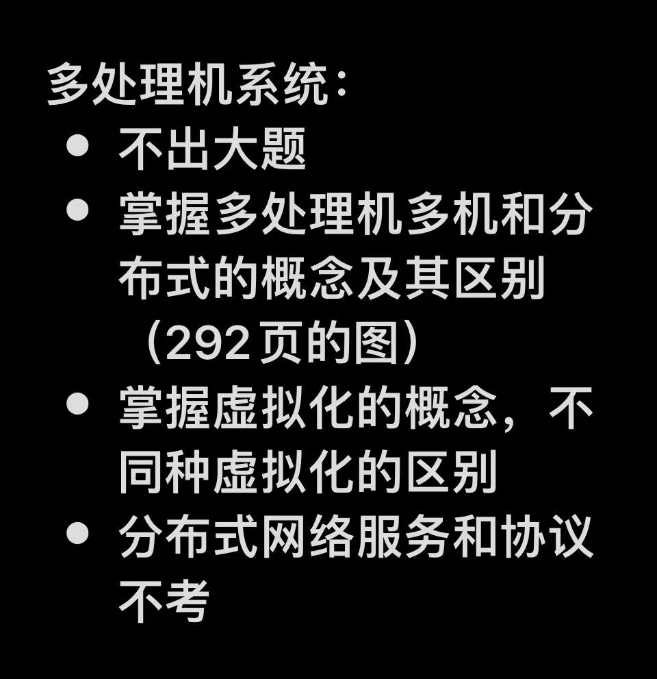

# ch7 多处理机系统（Multiprocessor System）

***指增加CPU数量的系统，即多CPU系统***

## 3 种系统模型

*（都属于多处理机系统）* 

### 共享存储器多处理机（Multiprocessor）

**多处理机** = <u>共享存储器**多处理机**</u> =》无耦合

（≠ **多核**！多核一般指单个CPU中集成了多个核心；不过**多处理机**的同时也确实实现了<u>多个核心共享存储器</u>）

**本质**：多个**CPU**（处理机/ 处理器）共享同一个**RAM**存储器（**Shared Memory**），每个**CPU**均可访问<u>整个**RAM**</u>（<u>**纳秒级**上访问共享存储器</u>；共享存储器也算是一种**CPU**间通信）

#### 2 种硬件实现

##### UMA（Uniform Memory Access，统一存储器访问）

存储器中任何一个<u>字</u>的<u>读取速度都一致</u>

###### 基于总线的实现

每个**CPU**配一个**Cache**以<u>解决总线繁忙问题</u>（**Cache**可高速缓存，有的读操作无需使用总线；当一个**CPU**申请写**Cache**时，总线通知其他**CPU**的**Cache**丢弃干净副本，把脏副本写回存储器，再让写者从存取器取得高速缓存块再对其写，或者直接把脏副本传给写者）

每个**CPU**再配一个**私有存储器**（不是寄存器）存放<u>私有内容</u>和其他<u>只读内容</u>，因为共享**RAM**只能放<u>可写的共享内容</u>

###### 基于交叉开关（Crossbar Switch）的实现

（看课本p294）

用于把一组**进线**在**交叉点（Crosspoint）**处连接到任意一组**出线**上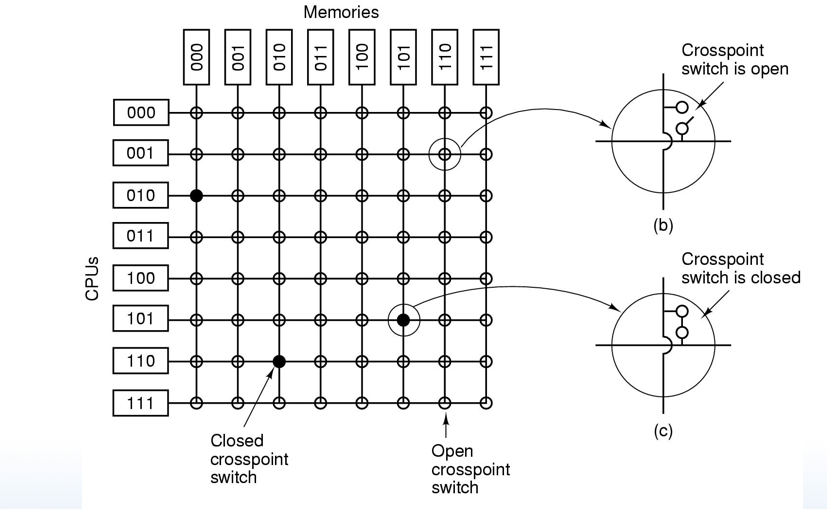

**优势**：形成**非阻塞网络**（解决了总线繁忙的问题），可同时解决多组请求

**缺陷**：**交叉点**数量以n^2^方式增长

###### 基于交换网络（Omega Switch）的实现

####  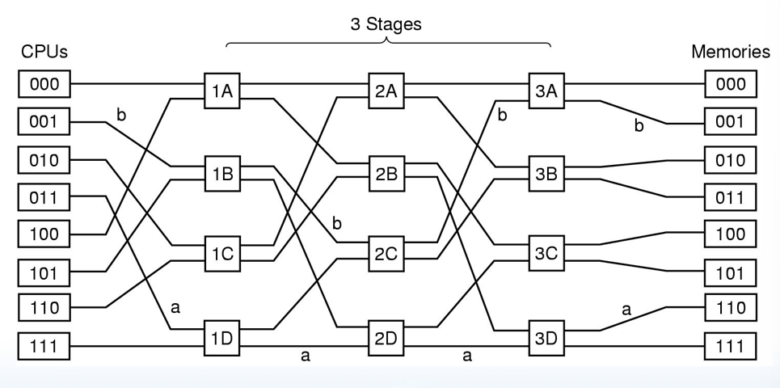

**优势**：**交叉点**数少

****

##### NUMA（Nonuniform Memory Access，非一致存储器访问）

存储器中不同<u>字</u>的<u>读取速度不一致</u>

#### 3 种多处理机操作系统

##### 每个CPU有自己的操作系统（非对称）

每个**CPU**有一份操作系统代码副本（都一样），以及自己的数据，存放在**RAM**给每个**CPU**的静态私有分区中；每个操作系统有独立的表、独立的进程集合（由自己调度的）、独立的物理页框空间（只能置换自己的页面；导致一个**CPU**内存不够用时其他**CPU**的多余内存不可用）；独立维护自己对磁盘的缓冲区caching，导致不同**CPU**的缓冲区中的脏磁盘块可能不一致（解决：取消磁盘缓冲区caching）

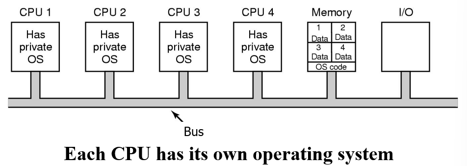

##### 主从多处理机（Master-slave；非对称）

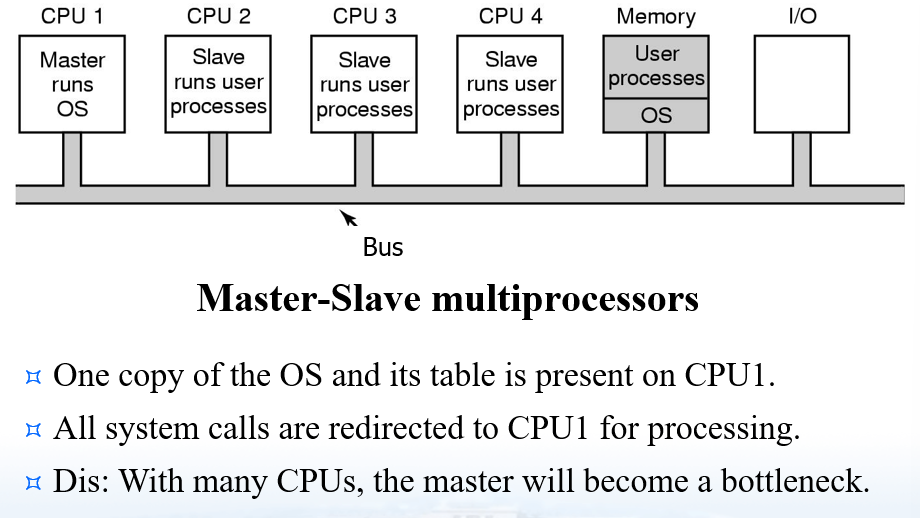

##### 对称多处理机（Symmetric）

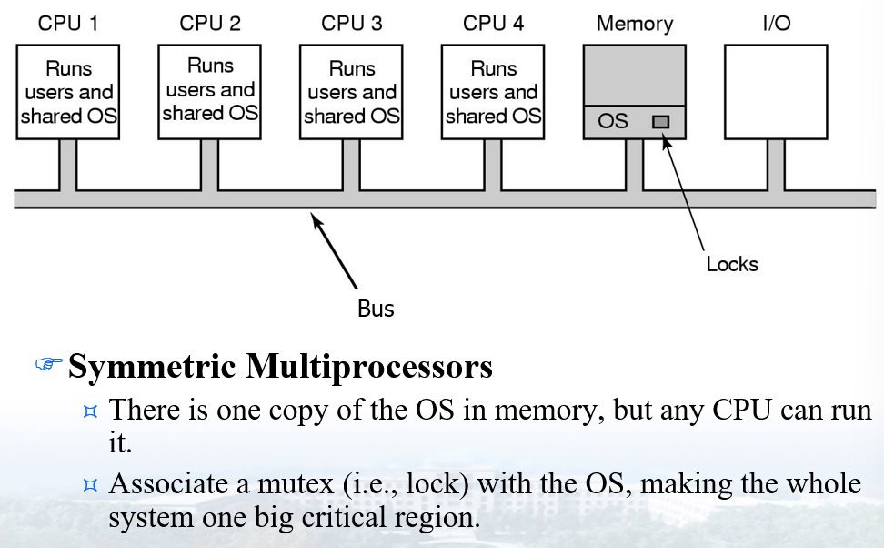

#### 多处理机同步

### 多计算机（Multicomputers）

**多计算机** = <u>消息传递**多计算机**</u> = **机群（Cluster）**计算机 = 工作站机群（COWS）=》**紧密耦合（Couple）**

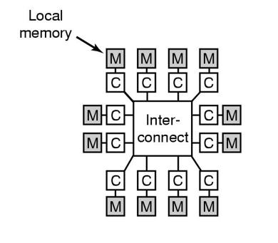

**本质**：每个**CPU**有自己的**本地存储器**（<u>紧耦合**CPU**</u>），不共享存储器（*<u>只能使用**NUMA**！</u>*），用<u>高速互连网络</u>和接口实现高性能消息传递（<u>**微秒级**上发送消息</u>，比**多处理机**更<u>容易实现硬件</u>，但<u>编程更难</u>）

#### 5 种互联技术硬件实现

（看课本p307-p308）

星形/ 环形/ 网格形/ 双凸面/ 三维（超）立方体

### 分布式系统（Distributed System）

**分布式系统** = **广域分布式系统（Wide Area Distributed System）** =》**松散耦合**

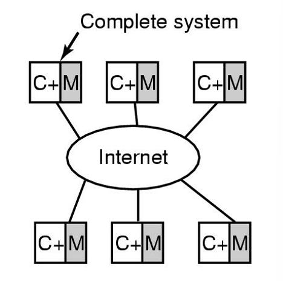

**本质**：每个计算机有自己的存储器，构成完整的系统，通过一个<u>广域网</u>（如因特网）连接起来进行消息传递（<u>时间比**多计算机**通信时间长，为10-100ms</u>）

## 3 种多处理机系统对比

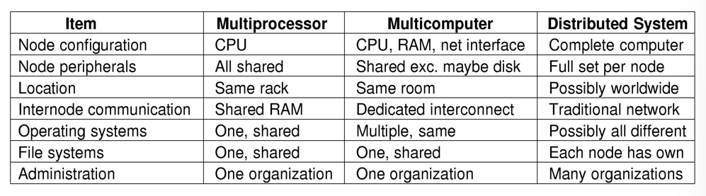

## 虚拟化技术

（结合第一章虚拟机的内容复习）

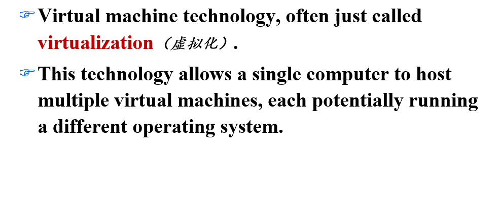

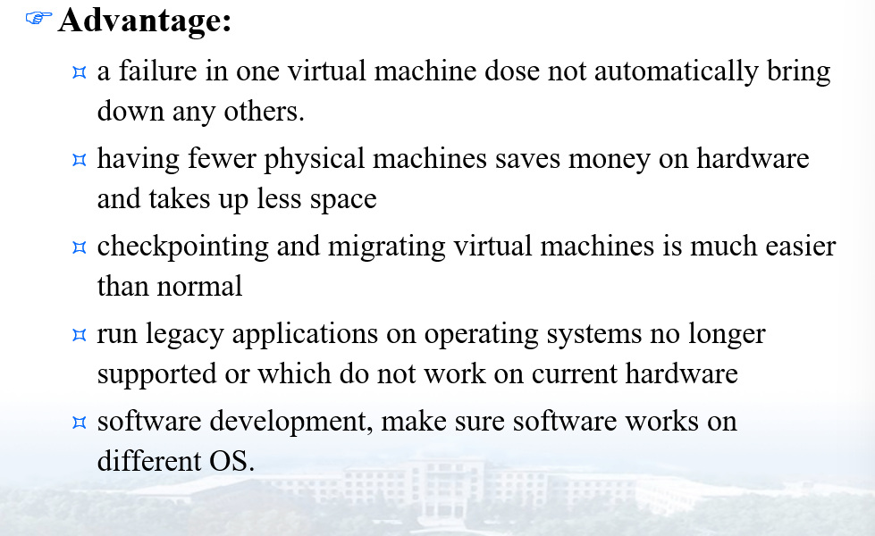

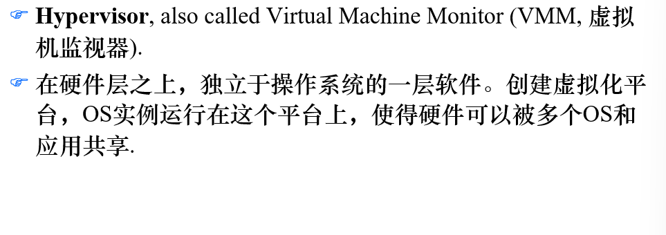

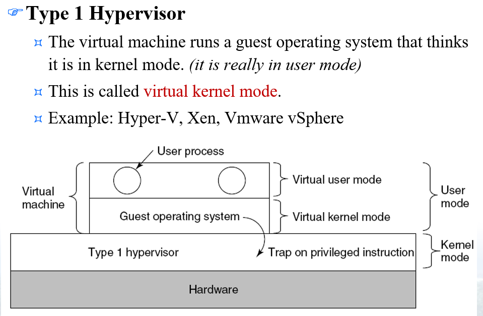

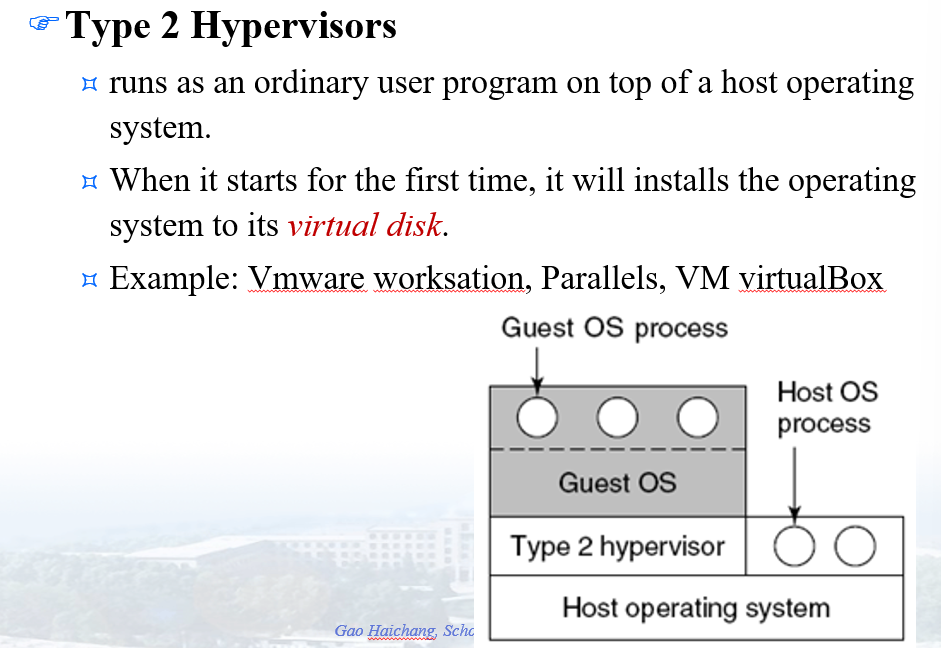
