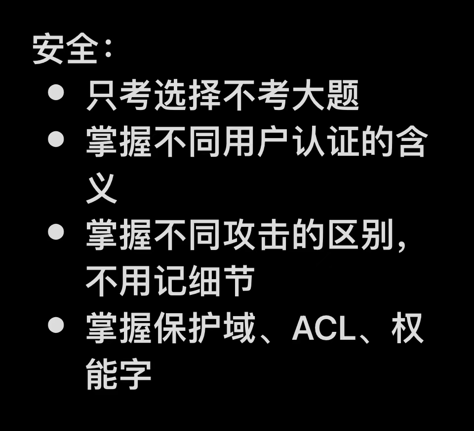

# ch8 安全

*（指 **Security**，Safety 是指系统自身功能的稳定正确）*

## 目的和威胁

## 用户认证

### 3 种认证手段

1.  认证**用户已知信息**

    例：密码

    优缺点：无需额外设备；易窃取、遗忘

2.  认证**用户已有信息**

    例：U盘密钥

    缺点：需要额外设备，易窃取、丢失

3.  认证**用户身份**

    例：生物认证（指纹、瞳孔）

    优缺点：最安全、最方便；被窃取后无法修改

    

### 2 种登陆机制

-   在输入用户名后，若用户不存在就立刻输出警告
-   在用户名和密码都输入后，若用户不存在或密码错误，才发出登录失败的警告，而不指明是用户名无效还是密码无效（更安全）

## 加密技术（Cryptography）

需要同时知道**解密密钥（Decryption Key）**& **解密算法（Decryption Algorithm）**才能成功对**密文（Cyphertext）**解密获得**明文（Plaintext）**

## 一次性密码

使用**单向散列链（One-way Hash Chain）**实现不用用密码本记录密码的**一次性密码**加密技术，使得<u>用户每次输入自己的密码但系统将其转换为一个每次不同的新密码</u>作为实际密码：

用**单向函数（指给定x易求出y，但给定y很难求出准确的x）y=f(x)** 实现该转换；

用户给出初始密码 s 和密码使用次数 n，则：

**第 i 次密码： P~i~ = f (P~i+1~)** 

（看课本p357）

## 保护机制（Protection Mechanism）

### 保护域

即**“域”**

**本质**： (**对象**<指操作对象，**Object**>, 权限<指操作权限>) <u>关系对</u>

**域**限制在该**域**上运行的某个/组**用户（Subject，一般指用户进程）**可以做什么、不能做什么；运行过程可以发生**域**切换（如系统调用时） 以改变操作权限

**最低权限原则（POLA，Principle of Least Authority）**：当每个**域**都拥有最少数量的**对象**和满足其（指**域**对应的**用户**）完成工作所需的最低**权限**时，安全性最好

**实现**：

1.  **保护矩阵（Protection Matrix）**

    行为**域**号，列为**对象**，元素内容为**权限**

    缺陷：<u>大多数的域都不能访问大部分对象</u>，导致形成<u>稀疏矩阵</u>，浪费存储空间

2.  **访问控制列表（ACL，Access Control List）**

    <u>以**对象**为键</u>建立列表（即**ACL**）数组，每个对象的**ACL**中各项包含某**用户**的**域**号和对应**权限**，放在<u>**内核空间**</u>中（不允许**用户**修改**ACL**）

    

3.  **权能字列表（Capability List，C-list）** 

    让每个**用户**映射到**内核空间**中的一个列表（即**CL**），列表每一项称作**权能字（Capability）**，包含某**对象**和对应**权限**

    （也可以不放在**内核空间**，用另外两种方法保护<看课本p344>：① 建立带标记的体系结构\<Tagged Architechture> ② 在用户空间加密管理）

    

## 内部攻击（Inside Jobs）

由公司内部系统程序员实施

（看课本p371-p372）

### 后门陷阱（Trap Door）

通过插入一段代码使得能够<u>绕过正常认证过程</u>

**对策**：定期**代码审查（Code Review）**

------

### 逻辑炸弹（Logic Bomb）

员工为了不让自己失业在公司的产品中编写需要特定信息才能保障产品安全的炸弹程序

------

### 登录欺骗

编写一个不能运行被登录程序的假官网，让用户输入密码，获取密码后跳转到真官网（在用户看来像密码输错了要重新输入）

## 恶意软件（Malware）

### 特洛伊木马（Torjan Horse Attack）

把恶意代码嵌入有用的软件让用户自愿下载，而不用主动侵入

------

### 病毒（Virus）

（看课本p376-p381）

一种特殊程序，可用“dropper”工具植入到一般程序中（寄生），随用户对寄主的操作（寄主未运行时病毒休眠）被激活并复制（感染其他程序），以及执行自己的操作（Payload）（可能传播到一定广度才执行）

****

### 蠕虫（Worm，网络蠕虫）

无需寄生，是独立执行的程序，无需用户激活，在计算机网络上自发靠系统漏洞从一个计算机复制到另一个上